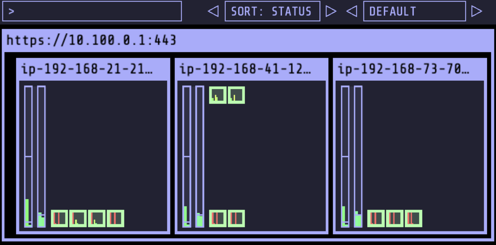
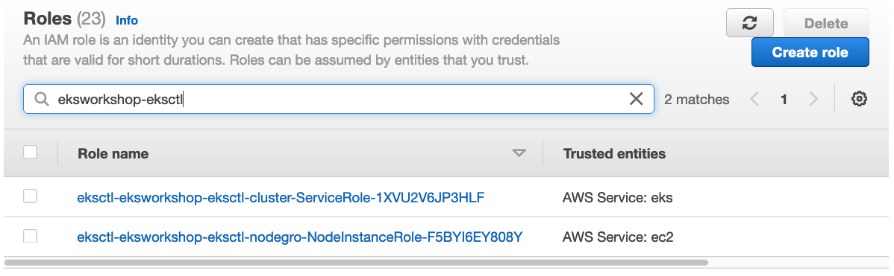

## 사전 조건
> eksworkshop-admin role 생성
> cloud9 인스턴스에 eksworkshop-admin role 추가

## 기본실행 (Blueprint를 사용하지 않은 경우)
    . 01.modify-disk-size.sh
    . 02.install-tools.sh
    . 03.setting-environment.sh
    . 04.launch-eks-cluster.sh
    . 05.post-eks-cluster.sh

## Brueprint를 사용한 경우
    aws s3 cp s3://ee-assets-prod-us-east-1/modules/bd7b369f613f452dacbcea2a5d058d5b/v6/eksinit.sh . && chmod +x eksinit.sh && ./eksinit.sh ; source ~/.bash_profile ; source ~/.bashrc

## Helm, Kube-Ops-View, Metric server 설치
    . 06.install-helm.sh

## 참고사항
* 클러스터 생성에 약 20여분 소요됨.
* 클러스터가 생성되는 동안 [ClusterConfig Examples](https://github.com/weaveworks/eksctl/tree/main/examples).
* t3인스턴스를 m5인스턴스로 변경.  
* Nitro-based instance를 사용하기 위함.

## 설치 후 IAM Role 확인

## Console Credentials
* Cloud9에서 CLI를 이용하여 생성한 클러스터의 경우 Console에서는 클러스터의 detail 정보를 가져올 수 없음
* Console의 IAM user 또는 role을 클러스터에 연결하여 권한을 주어야 함.
* IAM object와 k8s 클러스터의 object를 연결하는 명령어 사용  

    eksctl create iamidentitymapping --cluster eksworkshop-eksctl --arn ${rolearn} --group system:masters --username admin

## Custom AMI
* “eksworkshop_al2022.yaml“ 파일을 이용하여 ekscluster 생성
* eksworkshop_al2022.yaml은 Amazon Linux 2022 preview 버전
* AL2에는 containerd 데몬이 들어가 있으나, 그 외에는 설치해주어야 함.
* 1.23부터 docker는 deprecate되고, containerd만 남음.
* 커스텀 AMI인 경우, “overrideBootstrapCommand” 이 있어야 함. 
