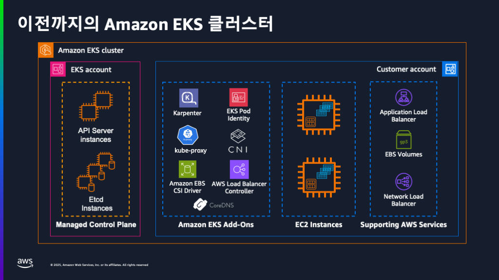
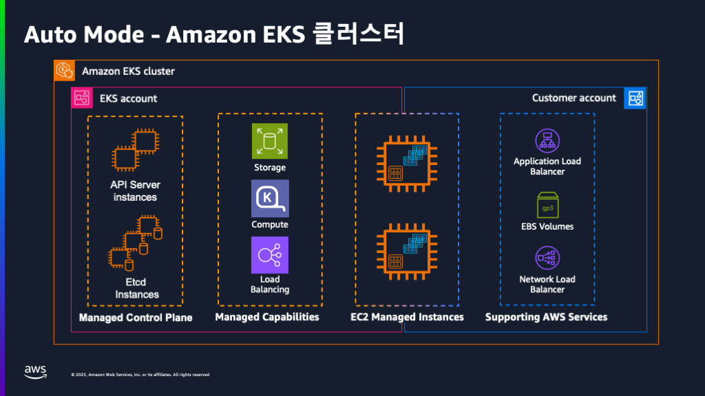
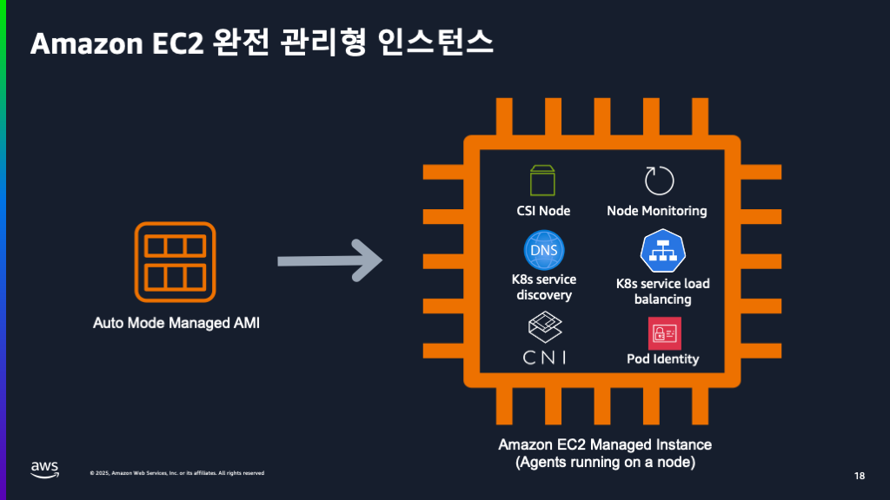
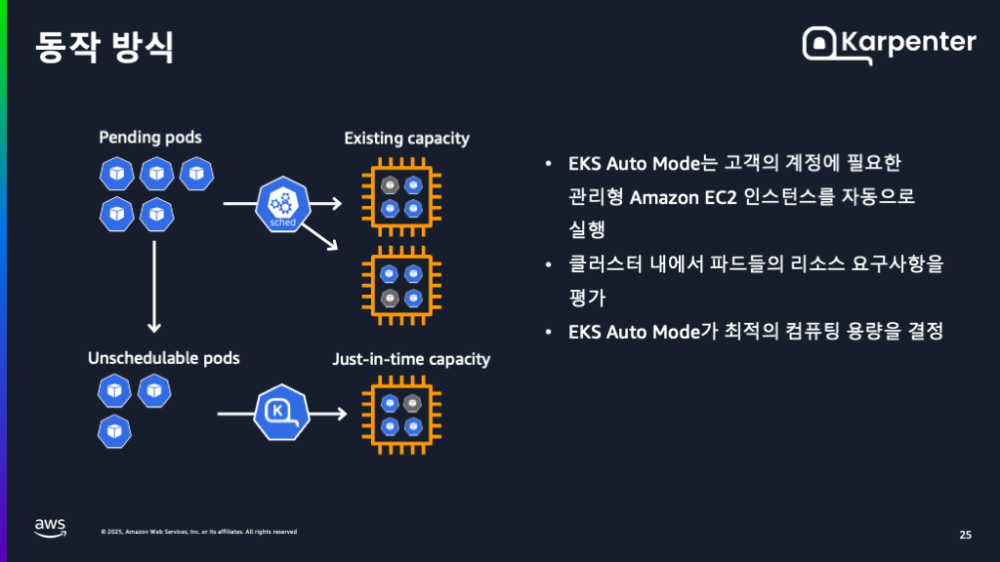
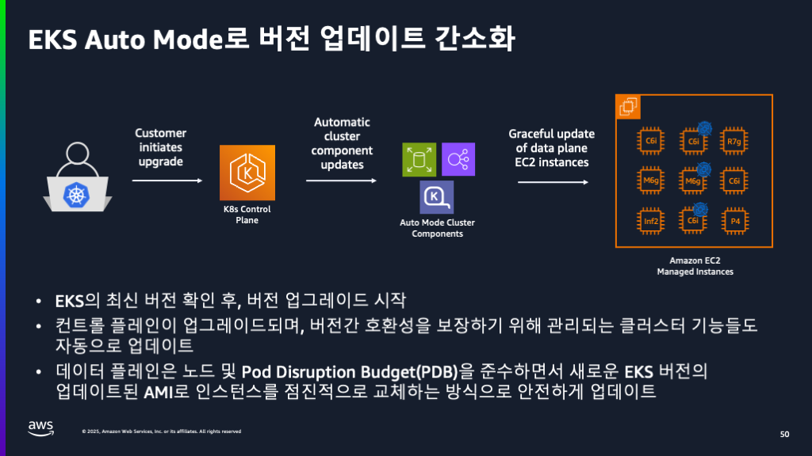

## Amazon EKS Auto Mode






## Access the cluster
* 두개의 클러스터가 사전에 프로비저닝 되어 있음
* 첫 번째 클러스터는 EKS Auto Mode의 기능 핸즈온 용
* 두 번째 클라스터는 마이그레이션 핸즈온 용


클러스터 확인
```shell
kubectl config get-contexts
```
마이그레이션 클러스터로 스위치
```shell
kubectl config use-context arn:aws:eks:${AWS_REGION}:${AWS_ACCOUNT_ID}:cluster/migration-cluster
```
데모 클러스터로 스위치
```shell
kubectl config use-context arn:aws:eks:${AWS_REGION}:${AWS_ACCOUNT_ID}:cluster/demo-cluster
```

### 실행중인 파드와 노드 확인
```shell
kubectl get pod --all-namespaces
kubectl get nodes
```