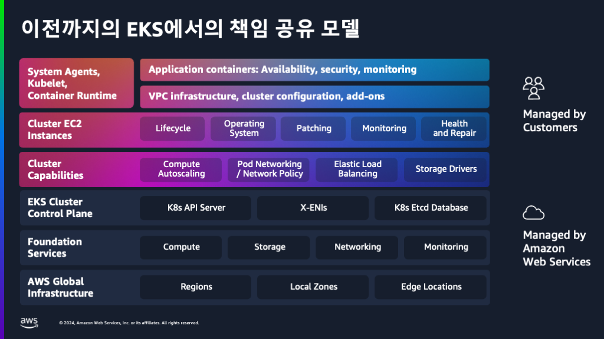
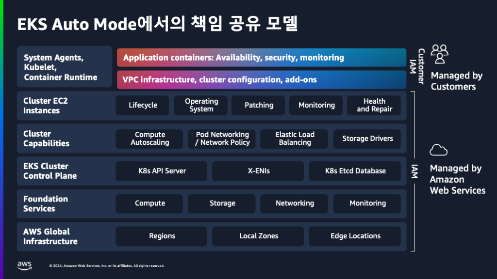
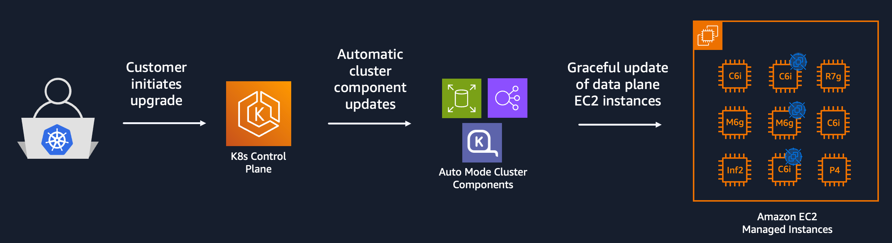

## Amazon EKS 버전 업그레이드

### Version 발표와 지원
* Kubernetes는 4개월마다 마이너 버전을 발표
* 각 버전은 1년가 커뮤니티에서 지원
* Amazon EKS의 경우 기본 14개월 표준지원, 이후 12개월 간 확장지원(추가 과금)
* api server version 1.33기준, 하위 3개 버전까지의 데이터 플레인과 호환 (1.33, 1.32, 1.31. 1.30)
* 하위 버전 호환성 체크 필요 [Link](https://kubernetes.io/releases/version-skew-policy/)
* 버전 업그레이드를 위한 가이드 [Link](https://docs.aws.amazon.com/eks/latest/best-practices/cluster-upgrades.html)

### 버전 업그레이드가 필요한 이유
* **보안** : 취약점으로부터 클러스터를 보호
* **안정성** : 안정적인 성능과 호환성 보장
* **혁신** : 최신 기능에 대한 액세스

### 공동 책임 모델의 변화



## Amazon EKS Auto Mode 업그레이드


### 업그레이드 진행과정
* 버전 식별
* 컨트롤 플레인 업그레이드 : 관리되는 클러스터 기능도 자동으로 업데이트되어 버전 간 호환성을 보장
* 데이터 플레인 업그레이드
    * 카펜터 기능의 드리프트 관리를 사용하여 최신 AMI로 노드 교체
    * 롤링 업데이트 전략
    * 파드 중단 예산(PDB) 준수

### 업그레이드 제어
* 기본값: 워크 노드는 14일 이내에 완전히 자동으로 업그레이드
* 사용자 지정 노드풀: 최대 21일
* Amazon EKS Auto Mode 는 `terminationGracePeriod`의 기본값을 24시간으로 설정
* `terminationGracePeriod`는 카펜터가 노드를 강제로 정리하기 전에 노드를 비울 수 있는 시간을 정의
* PDB(Pod Disruption Budgets)와 do-not-disrupt와 같이 축출을 차단하는 파드들은 `terminationGracePeriod`에 도달할 때까지 드레이닝 과정에서 유지되며, 이 기간이 지나면 해당 파드들은 강제로 삭제
* `spec.disruption.budgets`을 이용하여 업그레이드 시 중단할 노드의 비율을 설정
* 중단 예산 구성
    * **`Empty`**: 노드가 비었을 때
    * **`Underutilized`** : 노드가 삭제될 수 있거나, 다른 작은 노드로 통합할 수 있을 정도로 낮은 사용율
    * **`Drifted`** : 노드가 원하는 상태에서 벗어난(Drifted) 것으로 표시될 때를 의미

* `general-purpose` 노드 풀의 중단 예산

    ```
    ...
    spec:
      disruption:
        consolidateAfter: 0s
        consolidationPolicy: WhenEmptyOrUnderutilized
        budgets:
        - nodes: 10%
    ...

* 한 번에 노드의 10%만 중단 가능
    
    ```
        ```
        ...
        spec:
          disruption:
            consolidateAfter: 0s
            consolidationPolicy: WhenEmptyOrUnderutilized
            budgets:
            - nodes: 10%
            - schedule: 0 9 * * mon-fri
              duration: 8h
              nodes: "0"
              reasons:
              - Drifted
        ...
    ```
    
## 클러스터 업그레이드
* 현재 버전 확인
  
  ```shell
  aws eks describe-cluster --region $AWS_REGION --name $DEMO_CLUSTER_NAME --query "cluster.version" --output text
  ```
  ```shell
  kubectl get nodes
  ```

* 업그레이드 하기 전에 비즈니스에 영향을 줄 수 있는 API의 중단이나 변경이 있는지 체크
* 추가로 설치했던 애드온들의 경우 클러스터 업그레이드 후에 버전 업을 해주어야 함
* 업그레이드 실행

  ```shell
  aws eks update-cluster-version --region $AWS_REGION --name $DEMO_CLUSTER_NAME --kubernetes-version 1.31
  ```
  ```shell
  {
    "update": {
        "id": "2c455a9d-7c5d-3752-a0cd-9f40e976620b",
        "status": "InProgress",
        "type": "VersionUpdate",
        "params": [
            {
                "type": "Version",
                "value": "1.31"
            },
            {
                "type": "PlatformVersion",
                "value": "eks.26"
            }
        ],
        "createdAt": "2025-05-23T08:14:41.412000+00:00",
        "errors": []
    }
  }
  ```

* 업그레이드 상태 체크
  ```shell
  kubectl get nodes
  ```
  ```shell
  kubectl get events | grep Drifted/Replace
  ```

<div style="display: flex; justify-content: space-between; padding: 20px 0;">
  <div>
    <a href="../ebs/README.md">
      ← Previous<br/>
      <b>EBS Storage</b>
    </a>
  </div>
  <div style="text-align: right">
    <a href="../migration/README.md">
      Next →<br/>
      <b>Migrate an Amazon EKS Cluster to EKS Auto Mode</b>
    </a>
  </div>
</div>