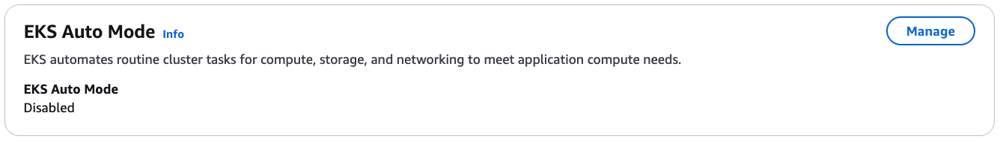
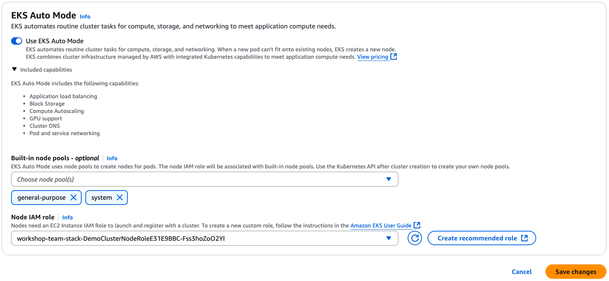
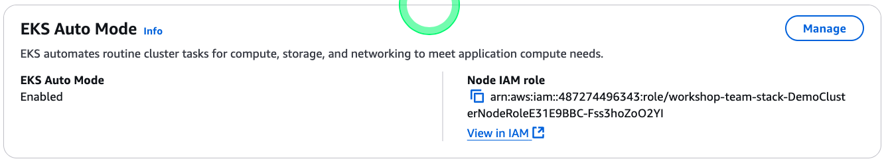
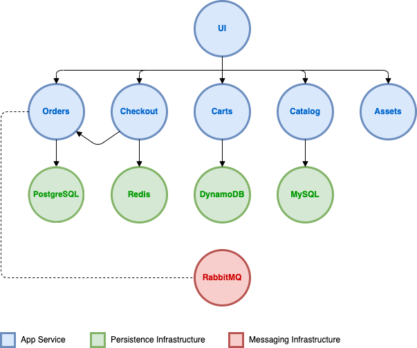
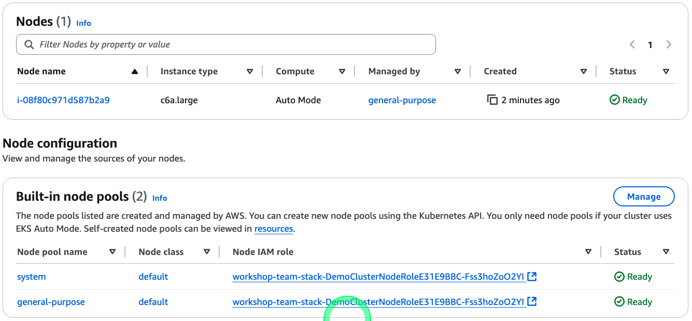

# Enable EKS Auto Mode

## Update the cluster IAM Role
* EKS Auto Mode를 위해 필요한 정책들  
    * AmazonEKSComputePolicy
    * AmazonEKSBlockStoragePolicy
    * AmazonEKSLoadBalancingPolicy
    * AmazonEKSNetworkingPolicy
    * AmazonEKSClusterPolicy

* 기존 클러스터용 IAM Role에 아래의 정책을 추가해야 함.
```shell
AmazonEKSComputePolicy 
AmazonEKSBlockStoragePolicy 
AmazonEKSNetworkingPolicy 
AmazonEKSLoadBalancingPolicy 
```
* CLI 명령어를 이용하여 추가
```shell
for POLICY in \
  "arn:aws:iam::aws:policy/AmazonEKSComputePolicy" \
  "arn:aws:iam::aws:policy/AmazonEKSBlockStoragePolicy" \
  "arn:aws:iam::aws:policy/AmazonEKSLoadBalancingPolicy" \
  "arn:aws:iam::aws:policy/AmazonEKSNetworkingPolicy" \
  "arn:aws:iam::aws:policy/AmazonEKSClusterPolicy"
do
  echo "Attaching policy ${POLICY} to IAM role ${DEMO_CLUSTER_ROLE_NAME}..."
  aws iam attach-role-policy --role-name ${DEMO_CLUSTER_ROLE_NAME} --policy-arn ${POLICY}
done
```
* 클러스터용 IAM Role의 신뢰정책 수정
```shell
aws iam update-assume-role-policy --role-name $DEMO_CLUSTER_ROLE_NAME --policy-document '{
  "Version": "2012-10-17",
  "Statement": [
    {
      "Effect": "Allow",
      "Principal": {
        "Service": "eks.amazonaws.com"
      },
      "Action": [
        "sts:AssumeRole",
        "sts:TagSession"
      ]
    }
  ]
}'
```

    ```json
    # before
    {
        "Version": "2012-10-17",
        "Statement": [
            {
                "Effect": "Allow",
                "Principal": {
                    "Service": "eks.amazonaws.com"
                },
                "Action": "sts:AssumeRole"
            }
        ]
    }
    
    # after
    {
        "Version": "2012-10-17",
        "Statement": [
            {
                "Effect": "Allow",
                "Principal": {
                    "Service": "eks.amazonaws.com"
                },
                "Action": [
                    "sts:AssumeRole",
                    "sts:TagSession"
                ]
            }
        ]
    }
    ```
* 참고 : https://docs.aws.amazon.com/ko_kr/eks/latest/userguide/auto-cluster-iam-role.html
    
* IAM Role이 제대로 업데이트 되었는지 확인  

    ```shell
    aws iam get-role --role-name ${DEMO_CLUSTER_ROLE_NAME} | \
      jq -r '.Role.AssumeRolePolicyDocument.Statement[].Action[]'
    
    aws iam list-attached-role-policies --role-name ${DEMO_CLUSTER_ROLE_NAME} | \
      jq -r '.AttachedPolicies[].PolicyName'
    ```
    
    
    ```shell
    sts:AssumeRole
    sts:TagSession
    AmazonEKSClusterPolicy
    AmazonEKSNetworkingPolicy
    AmazonEKSComputePolicy
    AmazonEKSBlockStoragePolicy
    AmazonEKSLoadBalancingPolicy
    ```

## Enable EKS Auto Mode
* AWS CLI를 이용하는 방법
```shell 
aws eks update-cluster-config \
    --name ${DEMO_CLUSTER_NAME} \
    --compute-config enabled=true,nodeRoleArn=${DEMO_CLUSTER_NODE_ROLE_ARN},nodePools=system,general-purpose \
    --kubernetes-network-config '{"elasticLoadBalancing":{"enabled": true}}' \
    --storage-config '{"blockStorage":{"enabled": true}}'
```

* Console을 이용하는 방법
 


* 클러스터 업데이트 확인
* EKS Auto Mode 활성화로 생성된 CRD 확인



```shell
kubectl get crd | grep eks.amazonaws.com
```

```
cninodes.eks.amazonaws.com                   2025-01-22T12:25:06Z
ingressclassparams.eks.amazonaws.com         2025-01-22T12:25:02Z
nodeclasses.eks.amazonaws.com                2025-01-22T12:25:02Z
nodediagnostics.eks.amazonaws.com            2025-01-22T12:25:02Z
targetgroupbindings.eks.amazonaws.com        2025-01-22T12:25:02Z
```

## Deploy the sample application


```shell
cat << EOF > ~/environment/values-ui.yaml
endpoints:
    catalog: http://retail-store-app-catalog:80
    carts: http://retail-store-app-carts:80
    checkout: http://retail-store-app-checkout:80
    orders: http://retail-store-app-orders:80
    assets: http://retail-store-app-assets:80
EOF

helm upgrade -i retail-store-app-catalog oci://public.ecr.aws/aws-containers/retail-store-sample-catalog-chart --version ${RETAIL_STORE_APP_HELM_CHART_VERSION} --hide-notes
helm upgrade -i retail-store-app-orders oci://public.ecr.aws/aws-containers/retail-store-sample-orders-chart --version ${RETAIL_STORE_APP_HELM_CHART_VERSION} --hide-notes
helm upgrade -i retail-store-app-carts oci://public.ecr.aws/aws-containers/retail-store-sample-cart-chart --version ${RETAIL_STORE_APP_HELM_CHART_VERSION} --hide-notes
helm upgrade -i retail-store-app-checkout oci://public.ecr.aws/aws-containers/retail-store-sample-checkout-chart --version ${RETAIL_STORE_APP_HELM_CHART_VERSION} --hide-notes
helm upgrade -i retail-store-app-assets oci://public.ecr.aws/aws-containers/retail-store-sample-assets-chart --version ${RETAIL_STORE_APP_HELM_CHART_VERSION} --hide-notes
helm upgrade -i retail-store-app-ui oci://public.ecr.aws/aws-containers/retail-store-sample-ui-chart --version ${RETAIL_STORE_APP_HELM_CHART_VERSION} -f values-ui.yaml --hide-notes

```



```shell
kubectl get pod -A
```

```
NAMESPACE   NAME                                               READY   STATUS    RESTARTS        AGE
default     retail-store-app-assets-69d497dddd-dfgjt           1/1     Running   0               3m50s
default     retail-store-app-carts-5dbcfdf955-qkhcq            1/1     Running   1 (2m3s ago)    3m53s
default     retail-store-app-carts-dynamodb-65b5f9676c-227zr   1/1     Running   0               3m53s
default     retail-store-app-catalog-5bc5679b6c-x5xdm          1/1     Running   4 (2m11s ago)   3m57s
default     retail-store-app-catalog-mysql-0                   1/1     Running   0               3m57s
default     retail-store-app-checkout-6bdfb76454-gk968         1/1     Running   0               3m52s
default     retail-store-app-checkout-redis-8d8767dc6-mrzxc    1/1     Running   0               3m52s
default     retail-store-app-orders-555bfd8b84-26hlb           1/1     Running   1 (2m7s ago)    3m55s
default     retail-store-app-orders-postgresql-0               1/1     Running   0               3m55s
default     retail-store-app-orders-rabbitmq-0                 1/1     Running   0               3m55s
default     retail-store-app-ui-6d976c9777-fcjr4               1/1     Running   0               3m49s
```

```shell
kubectl get svc
```

```
NAME                                 TYPE        CLUSTER-IP       EXTERNAL-IP   PORT(S)              AGE
kubernetes                           ClusterIP   10.100.0.1       <none>        443/TCP              23h
retail-store-app-assets              ClusterIP   10.100.98.104    <none>        80/TCP               5m5s
retail-store-app-carts               ClusterIP   10.100.86.240    <none>        80/TCP               5m8s
retail-store-app-carts-dynamodb      ClusterIP   10.100.183.209   <none>        8000/TCP             5m8s
retail-store-app-catalog             ClusterIP   10.100.6.117     <none>        80/TCP               5m12s
retail-store-app-catalog-mysql       ClusterIP   10.100.136.63    <none>        3306/TCP             5m12s
retail-store-app-checkout            ClusterIP   10.100.40.131    <none>        80/TCP               5m7s
retail-store-app-checkout-redis      ClusterIP   10.100.83.183    <none>        6379/TCP             5m7s
retail-store-app-orders              ClusterIP   10.100.16.124    <none>        80/TCP               5m10s
retail-store-app-orders-postgresql   ClusterIP   10.100.182.65    <none>        5432/TCP             5m10s
retail-store-app-orders-rabbitmq     ClusterIP   10.100.5.37      <none>        5672/TCP,15672/TCP   5m10s
retail-store-app-ui                  ClusterIP   10.100.26.36     <none>        80/TCP               5m4s
```

* 포트 포워딩을 설정하여 외부에서 UI 접속
    * 워크샵에서는 핸즈온 IDE 인스턴스의 8080포트를 외부에서 접속할 수 있도록 CloudFront를 설정해둔 상태

```shell
kubectl port-forward $(kubectl get pods \
 --selector=app.kubernetes.io/name=ui -o jsonpath='{.items[0].metadata.name}') 8080:8080
```