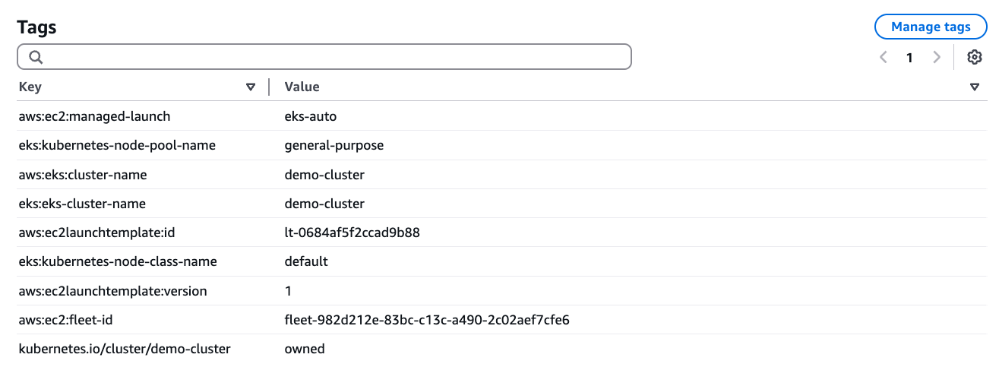
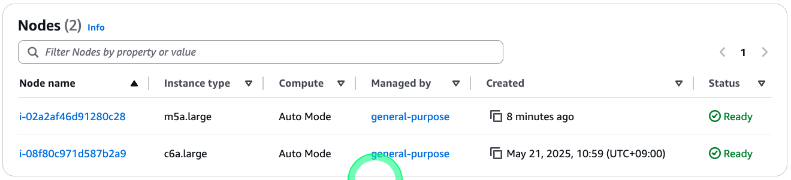
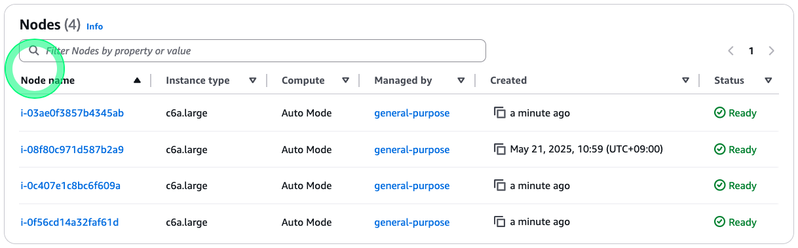

# Compute
## Overview 
### 기본 기능
- EKS가 컴퓨팅 리소스를 자동으로 프로비저닝하고 관리
- EC2 인스턴스 생성 및 EKS 클러스터에 노드로 자동 연결
- 워크로드가 기존 노드에서 실행될 수 없을 때 적절한 크기의 새 EC2 인스턴스를 자동 생성

### 관리형 인스턴스 특징
- EC2 관리형 인스턴스로 운영됨
- 운영 제어를 서비스 제공자(EKS)에게 위임
- AWS의 운영 전문성과 모범 사례 활용 가능

### 관리 범위
- 인스턴스 프로비저닝
- 소프트웨어 구성 
- 용량 조정
- 인스턴스 장애 및 교체 처리
- AWS 콘솔에서 인스턴스 모니터링 가능
- 임시 스토리지로 인스턴스 스토리지 사용 가능

## EKS Auto Mode 설정
| 구성                     | 설명 |
|--------------------------|------|
| **주요 구성 요소**       | <ul><li>Karpenter 객체 기반 동작</li><li>NodeClass와 NodePools 사양 사용</li></ul> |
| **NodeClass 사양**       | <ul><li>인프라 수준 설정 정의</li><li>네트워크 구성, 스토리지 설정, 리소스 태깅 등</li></ul> |
| **NodePool 사양**        | <ul><li>세부적인 컴퓨팅 리소스 제어</li><li>EC2 인스턴스 카테고리, CPU 구성, 가용영역, 아키텍처(ARM64/AMD64), 용량 유형(스팟/온디맨드)  등</li></ul> |
| **기본 관리형 NodePool** | <ul><li><b>일반 용도(general-purpose)</b> : 사용자 배포 애플리케이션 및 서비스 처리</li><li><b>시스템(system)</b> : 클러스터 운영을 위한 핵심 시스템 구성 요소 전용</li></ul> |


```shell
kubectl get nodes -l karpenter.sh/nodepool=general-purpose
kubectl get nodes -l karpenter.sh/nodepool=system
```


## 애플리케이션 확장
* 노드 리스트 켜기
     ```shell
     watch kubectl get nodes
     ```
* 신규 터미널 오픈
* UI 파드를 스케일 아옷
    ```shell
    kubectl scale --replicas=12 deployment/retail-store-app-ui
    ```
* 클러스터의 Event 보기
    ```shell
    kubectl events
    ```
* 노드별로 보기
    ```shell
    for node in $(kubectl get nodes -l karpenter.sh/nodepool=general-purpose -o custom-columns=NAME:.metadata.name --no-headers); do
      echo "Pods on $node:"
      kubectl get pods --all-namespaces --field-selector spec.nodeName=$node
    done
    ```
* 요구되는 파드의 사양 총합에 필요한 가성비 높은 인스턴스 실행


## 애플리케이션의 회복성 개선
* 애플리케이션을 멀티 AZ에 배포하여 가용성과 장애시 회복력을 높일 수 있음
* Topology spread Constraints를 설정하여 UI를 다시 배포
    ```shell
    cat  << EOF >~/environment/values-ui.yaml
    endpoints:
      catalog: http://retail-store-app-catalog:80
      carts: http://retail-store-app-carts:80
      checkout: http://retail-store-app-checkout:80
      orders: http://retail-store-app-orders:80
      assets: http://retail-store-app-assets:80
    
    topologySpreadConstraints:
      - maxSkew: 1      # 두 AZ 또는 두 노드간의 파드 수 차이가 1을 넘지 않게
        minDomains: 3   # 최소 AZ수
        topologyKey: topology.kubernetes.io/zone
        whenUnsatisfiable: DoNotSchedule
        labelSelector:
          matchLabels:
            app.kubernetes.io/name: ui
    EOF
    
    helm upgrade -f ~/environment/values-ui.yaml retail-store-app-ui oci://public.ecr.aws/aws-containers/retail-store-sample-ui-chart --version ${RETAIL_STORE_APP_HELM_CHART_VERSION} --hide-notes
    ```
* UI를 스케일 아웃
    ```shell
    kubectl scale --replicas=12 deployment/retail-store-app-ui
    ```
* 노드별 파드 목록 다시 확인
    ```shell
    kubectl get node -L topology.kubernetes.io/zone --no-headers | while read node status roles age version zone; do
    echo "Pods on node $node (Zone: $zone):"
      kubectl get pods --all-namespaces --field-selector spec.nodeName=$node -l app.kubernetes.io/instance=retail-store-app-ui
    echo "-----------------------------------"
    done
    ```

    
    
# Autoscaling
## Overview
* 중단이 발새하는 상황 
    * 노드 스케일 다운(비용절감)
    * 노드 최대 수명 도달(만료)
    * 실행중인 파드에 영향을 미칠 수 있음
* Karpenter의 중단 관리 매커니즘
    * 만료(expireation)
    * 드리프트 감지(drift detection)
    * 통합(consolidation)

### 통합(Consolidation)
* Karpenter는 저사용율/유휴 노드가 식별되면 클러스터 리소스를 최족화하기 위해 통합 프로세스를 작동
* 활성 워크로드가 없는 노드는 제거
* 허용 가능한 용량이 있는 노드에 효율적인 bin-packing(워크로드를 노드에 최적으로 배치하는 작업)
* 가용성을 유지하면서 노드를 드레이닝

* Node Pool 보기
```shell
kubectl get nodepools general-purpose -o yaml
```
* Disrupton Bock 
  * `WhenEmptyOrUnderutilized` 노드가 비어있거나, 사용율이 낮을 경우 비용을 줄이기 위해 노드를 제거하거나 교체
  * `expireAfter` 노드는 지정된 시간이후에 자동으로 제거됨

```yaml{15-19,23}
apiVersion: karpenter.sh/v1
kind: NodePool
metadata:
  annotations:
    karpenter.sh/nodepool-hash: "4012513481623584108"
    karpenter.sh/nodepool-hash-version: v3
  creationTimestamp: "2025-01-15T09:32:29Z"
  generation: 1
  labels:
    app.kubernetes.io/managed-by: eks
  name: general-purpose
  resourceVersion: "241001"
  uid: 9b1c4ad0-d42d-4c63-bd96-b0a201aeec0e
spec:
  disruption:
    budgets:
    - nodes: 10%          # 한 번에 최대 10%의 노드만 중단
    consolidateAfter: 30s # 비었거나 저사용율 노드가 감지된 후부터 통합이 시작되기까지 대기 시간
    consolidationPolicy: WhenEmptyOrUnderutilized
  template:
    metadata: {}
    spec:
      expireAfter: 336h # 노드의 수명(14일)
      nodeClassRef:
        group: eks.amazonaws.com
        kind: NodeClass
        name: default
      requirements:
      - key: karpenter.sh/capacity-type
        operator: In
        values:
        - on-demand
      - key: eks.amazonaws.com/instance-category
        operator: In
        values:
        - c
        - m
        - r
      - key: eks.amazonaws.com/instance-generation
        operator: Gt
        values:
        - "4"
      - key: kubernetes.io/arch
        operator: In
        values:
        - amd64
      - key: kubernetes.io/os
        operator: In
        values:
        - linux
      terminationGracePeriod: 24h0m0s
```

### Horizontal Pod Autoscaling
* EKS Auto Mode에서 애플리케이션 레벨의 스케일링을 위해서는 메트릭 서버를 설치해야 함.
* 콘솔의 Add-on 메뉴에서도 설치 가능하며, 아래와 같이 eksctl 명령어로도 설치 가능
  ```shell
  eksctl create addon --name metrics-server --cluster ${DEMO_CLUSTER_NAME}
  ```
  ```shell
  kubectl get deployment metrics-server -n kube-system
  ```
  ```shell
  kubectl top node
  kubectl top pods -l app.kubernetes.io/name=ui
  ```

* UI 콤포넌트 재배포

  ```shell
  helm upgrade -i retail-store-app-ui oci://public.ecr.aws/aws-containers/retail-store-sample-ui-chart \
    --version ${RETAIL_STORE_APP_HELM_CHART_VERSION} --hide-notes -f - << EOF
  endpoints:
    catalog: http://retail-store-app-catalog:80
    carts: http://retail-store-app-carts:80
    checkout: http://retail-store-app-checkout:80
    orders: http://retail-store-app-orders:80
    assets: http://retail-store-app-assets:80
  
  topologySpreadConstraints:
    - maxSkew: 1
      minDomains: 3
      topologyKey: topology.kubernetes.io/zone
      whenUnsatisfiable: DoNotSchedule
      labelSelector:
        matchLabels:
          app.kubernetes.io/name: ui
    - maxSkew: 1
      topologyKey: kubernetes.io/hostname
      whenUnsatisfiable: ScheduleAnyway
      labelSelector:
        matchLabels:
          app.kubernetes.io/instance: retail-store-app-ui
  
  autoscaling:
    enabled: true
    minReplicas: 3
    maxReplicas: 10
    targetCPUUtilizationPercentage: 80
  EOF
  ```

* hpa 확인
  
  ```shell
  kubectl get hpa  
  ```

* 부하 주기
  * 동시에 10개의 워커
  * 가각 초당 5개의 쿼리 전송
  * 최대 60분간 실행
  
  ```shell
  kubectl get hpa retail-store-app-ui --watch  
  ```

  ```shell
  kubectl run load-generator \
   --image=williamyeh/hey:latest \
   --restart=Never -- -c 10 -q 10 -z 3m http://retail-store-app-ui/utility/stress/100000
  ```
  ```shell
  kubectl delete pod load-generator
  ```