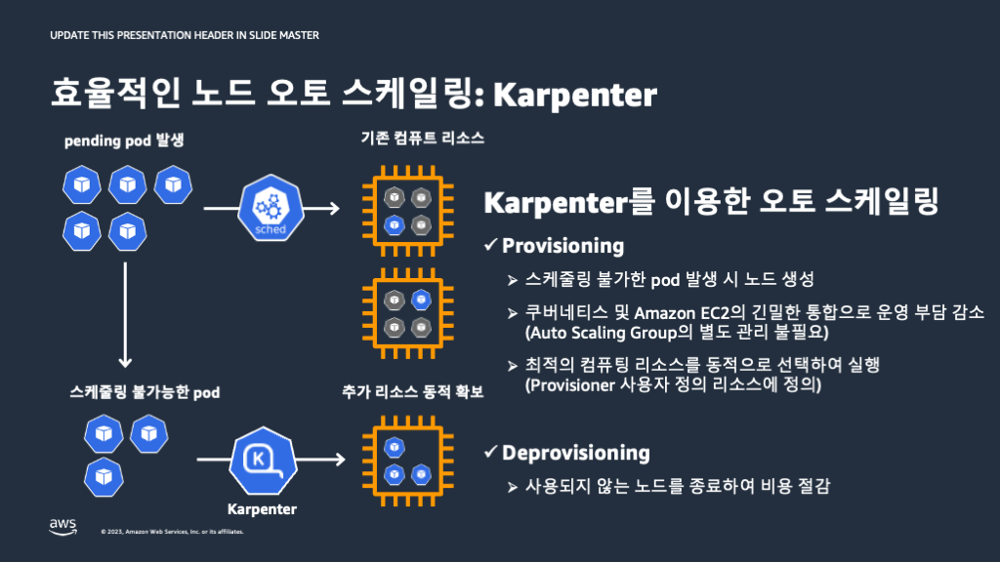

## Karpenter
* ASG의 인스턴스, EKS Cluster의 노드간 싱크 과정에서 문제가 발생할 수 있음
  * 수동으로 노드를 삭제려면, ASG 인스턴스도 수동으로 삭제해주어야 함
  * ASG에 연결된 `launch template`범위를 벗어날 수 없음
  * 특정 노드를 삭제하면서 동시에 노드 개수를 줄이기 어려움
  * ASG의 메커니즘은 오래된 놈 또는 어린 놈 순으로 삭제
  * ⚠️ pod가 적은 노드가 항상 오래된 인스턴스 또는 어린 인스턴스가 아님 --> 문제 발생
  * ⚠️ 스케쥴링이 안된 pod가 발생되어도, ASG 체크까지는 최대 수 분을 기다려야 함 --> 빠른 스케일 인/아웃에 한계
* Kubernetes 클러스터에서 사용할 수 있는 오픈소스 오토스케일링 기능
* JIT capacity 방식으로 노드를 즉시 추가


* 스케쥴링이 안된 pod가 발생하면(event 발생) 즉시 반응
* pod가 요청한 조건들resource requests, node selectors, affinities, tolerations, and topology spread constraints)을 평가하여 어떤 노드에 할당되어야 할지를 평가 후에 배치
* `kube-scheduler` 대신 karpenter가 직접 pod를 스케쥴링
* 월급 루팡 노드가 발견되면 제거
* 사용율이 적은 노드들을 하나로 통합
* 시작 템플릿이 필요 없음
* 보안그룹과 서브넷은 필수
* 참조 : [Karpenter Doc](https://karpenter.sh/docs/getting-started/getting-started-with-karpenter/#4-install-karpenter)

### Install Karpenter
```shell
helm upgrade --install karpenter oci://public.ecr.aws/karpenter/karpenter \
  --version "${KARPENTER_VERSION}" \
  --namespace "karpenter" --create-namespace \
  --set "settings.clusterName=${EKS_CLUSTER_NAME}" \
  --set "settings.interruptionQueue=${KARPENTER_SQS_QUEUE}" \
  --set controller.resources.requests.cpu=1 \
  --set controller.resources.requests.memory=1Gi \
  --set controller.resources.limits.cpu=1 \
  --set controller.resources.limits.memory=1Gi \
  --set replicas=1 \
  --wait
  
  kubectl get deployment -n karpenter
```

### Set up the Node Pool
* 노드의 사양을 정의하는 CRD(Custom Resource Definition) 정의
  * v0.31 이하 : provisioner, Nodetemplate
  * v0.32 이상 : NodePool, NodeClass

#### NodePool
* [NodePool CRD](https://karpenter.sh/docs/concepts/nodepools/)

```yaml
apiVersion: karpenter.sh/v1beta1
kind: NodePool
metadata:
  name: default
spec:
  template:
    metadata:
      labels:
        type: karpenter
    spec:
      requirements:
        - key: "karpenter.sh/capacity-type"
          operator: In
          values: ["on-demand"]
        - key: "node.kubernetes.io/instance-type"
          operator: In
          values: ["c5.large", "m5.large", "r5.large", "m5.xlarge"]
      nodeClassRef:
        name: default
  limits:
    cpu: "1000"
    memory: 1000Gi
  disruption:
    consolidationPolicy: WhenUnderutilized
    expireAfter: 720h # 30 * 24h = 720h
```
* `labels` : karpenter에 의해 생성된 노드들은 설정된 `label`이 붙음
  ```yaml
  labels:
    type: karpenter
  ```
* `requirements` : 노드의 사용을 정의
  * `on-demand`는 저비용
  * `spot`은 저비용 + 중단 빈도(낮은 순)
    ```yaml
    requirements:
      - key: "karpenter.sh/capacity-type"
        operator: In
        values: ["on-demand"]
      - key: "node.kubernetes.io/instance-type"
        operator: In
        values: ["c5.large", "m5.large", "r5.large", "m5.xlarge"]
    ```
* `limits` : 총 컴퓨팅의 용량 상한. 상한을 넘을 경우 더 이상 프로비전하지 않음
  ```yaml
  limits:
    cpu: "1000"
    memory: 1000Gi
  ```

#### EC2NodeClass
* 노드에 AWS의 특정 설정 구성 쌉가능
  ```yaml
  apiVersion: karpenter.k8s.aws/v1beta1
  kind: EC2NodeClass
  metadata:
    name: default
  spec:
    amiFamily: AL2023 # Amazon Linux 2023
    role: "${KARPENTER_ROLE}"
    subnetSelectorTerms:
      - tags:
          karpenter.sh/discovery: $EKS_CLUSTER_NAME
    securityGroupSelectorTerms:
      - tags:
          karpenter.sh/discovery: $EKS_CLUSTER_NAME
    tags:
      app.kubernetes.io/created-by: eks-workshop
  ```

#### NodePool, EC2NodeClass 적용
```shell
kubectl kustomize ~/environment/eks-workshop/modules/autoscaling/compute/karpenter/nodepool \
  | envsubst | kubectl apply -f-
 
kubectl logs -l app.kubernetes.io/instance=karpenter -n karpenter | jq '.'
```

### Automatic Node Provisioning
```yaml
apiVersion: apps/v1
kind: Deployment
metadata:
  name: inflate
  namespace: other
spec:
  replicas: 0
  selector:
    matchLabels:
      app: inflate
  template:
    metadata:
      labels:
        app: inflate
    spec:
      nodeSelector:
        type: karpenter
      terminationGracePeriodSeconds: 0
      containers:
        - name: inflate
          image: public.ecr.aws/eks-distro/kubernetes/pause:3.2
          resources:
            requests:
              memory: 1Gi
```
* 실습을 위해 `other` namespace의 pod를 모두 초기화
```shell
kubectl apply -k ~/environment/eks-workshop/modules/autoscaling/compute/karpenter/scale
```
* pod의 5개로 증가, 1Gi 메모리를 사용하는 pod가 5개 이므로, karpenter는 NodePool에 있는 스펙 중에서 5Gi의 메모리 이상을 가지면서도 가장 저렴한 `m5.large`를 신규노드로 추가
  ```shell
  kubectl scale -n other deployment/inflate --replicas 5
  
  kubectl rollout status -n other deployment/inflate --timeout=180s
  ```
  ```shell
  kubectl logs -l app.kubernetes.io/instance=karpenter -n karpenter | grep 'launched nodeclaim' | jq '.'
  ```

### Disruption(Colsolidation) 
* **Expiration** 기본적으로 Karpenter는 720시간(30일) 후에 인스턴스를 자동으로 만료하여 노드를 최신 상태로 유지할 수 있도록 재활용을 강제
* **Drift** 구성(NodePool, EC2NodeClass) 변경을 감지하여 필요한 변경을 적용
* **Consolidation** 가성비를 높이는 핵심 기능. 지속적으로 컴퓨팅을 최적화. 활용도가 낮은 인스턴스에서 워크로드가 실행되고 있을 경우, 더 적은 수의 인스턴스로 통합
  ```yaml
  apiVersion: karpenter.sh/v1beta1
  kind: NodePool
  metadata:
    name: default
  spec:
    template:
      metadata:
        labels:
          type: karpenter
      spec:
        requirements:
          - key: "karpenter.sh/capacity-type"
            operator: In
            values: ["on-demand"]
          - key: "node.kubernetes.io/instance-type"
            operator: In
            values: ["c5.large", "m5.large", "r5.large", "m5.xlarge"]
        nodeClassRef:
          name: default
    limits:
      cpu: "1000"
      memory: 1000Gi
    disruption:
      consolidationPolicy: WhenUnderutilized
      expireAfter: 720h # 30 * 24h = 720h
  ```
* `consolidationPolicy` : `WhenUnderutilized`(old ver), `whenEmptyOrUnderutilized`(latest ver.), `WhenEmpty`
* 실습
  * `inflate` 워크로드의 리플리카를 5에서 12로 증가시켜 karpenter의 프로비저닝을 유발
  * 리플리카를 5로 축소

  ```shell
  kubectl scale -n other deployment/inflate --replicas 12
  kubectl rollout status -n other deployment/inflate --timeout=180s
  ```
  * 12개 = 12Gi의 메모리, `kubelet`이 약 600Mi를 소비 ==> m5.large 2대가 적당
  ```shell
  kubectl get nodes -l type=karpenter --label-columns node.kubernetes.io/instance-type
  ```
  * 5개로 축소
  ```shell
  kubectl scale -n other deployment/inflate --replicas 5
  ```
  ```shell
  kubectl logs -l app.kubernetes.io/instance=karpenter -n karpenter | grep 'consolidation delete' | jq '.'
  ```
  * 1개로 축소하면 더 작은 인스턴스로 변경됨
  ```shell
  kubectl scale -n other deployment/inflate --replicas 1
  
  kubectl logs -l app.kubernetes.io/instance=karpenter -n karpenter -f | jq '.'
  ```