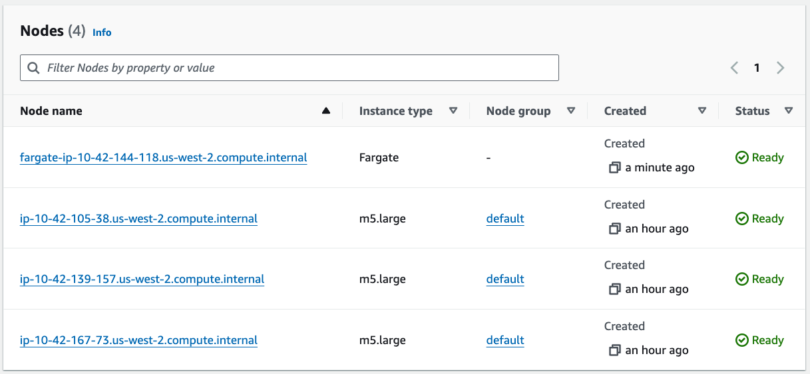

## Fargate


### Enabling Fargate
* fargate용 profile을 EKS cluster에 추가
* pod의 label에 해당 profile에 명기에 값을 표기하여 스케쥴링
```yaml
apiVersion: eksctl.io/v1alpha5
kind: ClusterConfig

metadata:
  name: $EKS_CLUSTER_NAME
  region: $AWS_REGION

fargateProfiles:
  - name: checkout-profile
    selectors:
      - namespace: checkout
        labels:
          fargate: "yes"
    subnets:
      - $PRIVATE_SUBNET_1
      - $PRIVATE_SUBNET_2
      - $PRIVATE_SUBNET_3
    podExecutionRoleARN: $FARGATE_IAM_PROFILE_ARN
```
* profile 추가 (수 분이 소요됨)
```shell
cat ~/environment/eks-workshop/modules/fundamentals/fargate/profile/fargate.yaml \
| envsubst \
| eksctl create fargateprofile -f -
```
### Scheduling on Fargate
* checkout pod을 fargate에 스케쥴링
  ```yaml
  apiVersion: apps/v1
  kind: Deployment
  metadata:
    name: checkout
  spec:
    template:
      metadata:
        labels:
          fargate: "yes"
  ```
  ```shell
  kubectl apply -k ~/environment/eks-workshop/modules/fundamentals/fargate/enabling
  kubectl rollout status -n checkout deployment/checkout --timeout=200s
  ```
* 배포 후, pod를 3개로 늘려보기
    ```shell
    kubectl scale -n checkout deployment/checkout --replicas=3
    ```
* pod를 늘린 후, 콘솔에서 Compute 상태 확인하기


### Resource allocation
* Fargate의 요금은 cpu와 memory 기준
* pod에서 사용할 수 있는 CPU, Memory 조합은 정해짐
* [Pod CPU and Memory](https://docs.aws.amazon.com/eks/latest/userguide/fargate-pod-configuration.html#fargate-cpu-and-memory)

```yaml
apiVersion: apps/v1
kind: Deployment
metadata:
  name: checkout
spec:
  template:
    spec:
      containers:
        - name: checkout
          resources:
            requests:
              cpu: "1"
              memory: 2.5G
            limits:
              memory: 2.5G
```
```shell
kubectl apply -k ~/environment/eks-workshop/modules/fundamentals/fargate/sizing
kubectl rollout status -n checkout deployment/checkout --timeout=200s
```
```shell
kubectl get pod -n checkout -l app.kubernetes.io/component=service -o json | jq -r '.items[0].metadata.annotations'
```