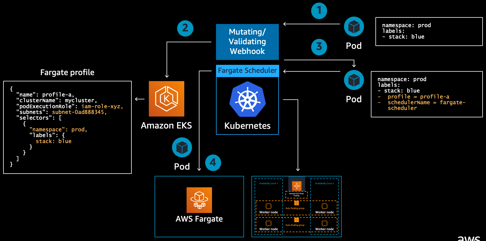

## Fargate



### Scheduling on Fargate
* 배포 후, pod를 3개로 늘려보기
    ```shell
    kubectl scale -n checkout deployment/checkout --replicas=3
    ```
* pod를 늘린 후, 콘솔에서 Compute 상태 확인하기

### Resource allication
* Fargate의 요금은 cpu와 memory 기준
* pod에서 사용할 수 있는 CPU, Memory 조합은 정해짐
* [Pod CPU and Memory](https://docs.aws.amazon.com/eks/latest/userguide/fargate-pod-configuration.html#fargate-cpu-and-memory)