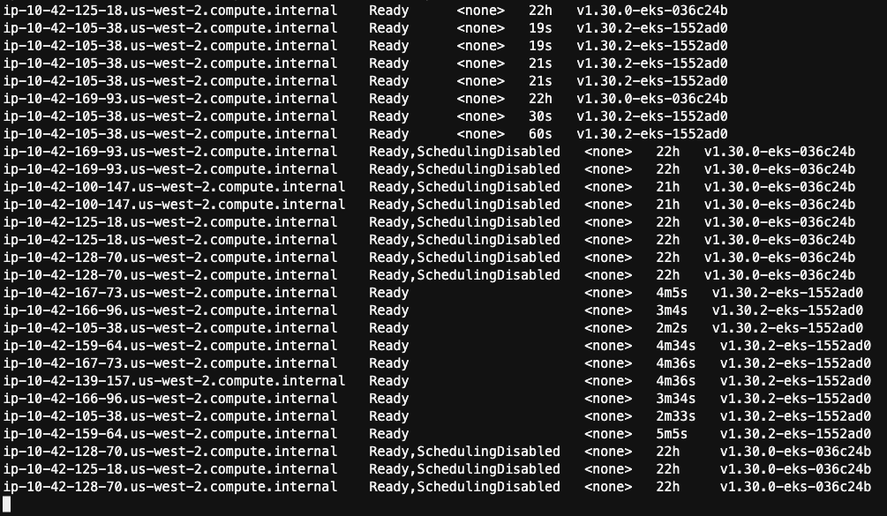

## Managed Node Group
* Amazon EKS 관리형 노드 그룹은 Amazon EKS 클러스터를 위한 노드의 프로비저닝 및 수명 주기 관리를 자동화
* 신규 AMI나 K8S 버전 배포에 따른 롤링 업데이트를 간소화할 수 있음
* Amazon EKS에 최적화된 최신 AMI를 프로비저닝
* AZ, CPU, Instance Type 등의 메터정보를 자동 태깅
* 애플리케이션의 가용성을 유지하면서 자동으로 노드의 업데이트와 종료
* EC2 비용 외에 추가적인 비용 없음

### MNG Basics
클러스터 내 노드의 정보 보기
```shell
eksctl get nodegroup --cluster $EKS_CLUSTER_NAME --name $EKS_DEFAULT_MNG_NAME
```
```shell
kubectl get nodes -o wide --label-columns topology.kubernetes.io/zone
```

### Add Nodes
* Node의 **desired capacity** 를 수정하여 노드의 수를 변경
    ```shell
    eksctl scale nodegroup --name $EKS_DEFAULT_MNG_NAME --cluster $EKS_CLUSTER_NAME \
    --nodes 4 --nodes-min 3 --nodes-max 6
    ```
* 2~3분 후에 노드가 추가 됨.
  ```
  eksctl get nodegroup --name $EKS_DEFAULT_MNG_NAME --cluster $EKS_CLUSTER_NAME
  ```
    ```shell
    kubectl get nodes -l eks.amazonaws.com/nodegroup=$EKS_DEFAULT_MNG_NAME
    ```
### Pod affinity and Anti-Affinity
* pod를 배포할 때, 워크로드의 특성이나 노드의 성능 등의 기준으로 스케쥴링 할 수 있음
* affinity에는 “node affinity” 와 “inter-pod affinity/anti-affinity”가 있음.
* node affinity
    * nodeSelector를 이용하여 노드의 라벨을 매칭
    * “requireDuringScheduling~” : 꼬옥.
    * “preferredDuringScheduling~” : 되로록...안되면 어쩔 수 없이 암데나.
    * “~IgnoreDuringExecution” : 일단 실행된 후에 조건이 미충족되더라도 계속 고.
    * In, NotIn, Exists, DoesNotExist, NotIn, Gt, Lt
    * nodeSelect 와  nodeAffinity를 모두 설정다면, 둘다 만족해야 함.
* pod affinity
  * 조건을 만족하는 pod들은 함께(반드시 같은 곳은 아님) 실행되도록 스케쥴링.
  * topologyKey에 따라 한 노드가 될 수도 있고 아닐 수도 있음.
  * anti-affinity는 함께 실행되지 않도록 스케쥴링 → 고가용성 전략에서 활용.
  * AntiAffinity는 ReplicaSets, StatefulSets, Deployments 등의 레벨에서 사용.
  * affinity와 anti-affinity 규칙을 설정하면 Pod 간의 분산과 집중을 제어할 수 있어, 리소스 활용, 가용성, 성능 등을 개선할 수 있음.


### 실습 개요
* 서로 다른 노드에 있는 checkout-redis와 checkout pod
* 노드당 하나의 checkout-redis pod 배포, checkout-redis pod가 있는 노드에 checkout pod 배포
  
    |   node 1   |   node 2   | node 3  |
    |:----------:|:----------:|:-------:|
    | checkout 1 | checkout 2 |  checkout 3  |
    |  redis 1   |  redis 2   | redis 3 |

```yaml
apiVersion: apps/v1
kind: Deployment
metadata:
  name: checkout
  namespace: checkout
spec:
  template:
    spec:
      affinity:
        podAffinity:
          requiredDuringSchedulingIgnoredDuringExecution:
            - labelSelector:
                matchExpressions:
                  - key: app.kubernetes.io/component
                    operator: In
                    values:
                      - redis
              topologyKey: kubernetes.io/hostname
        podAntiAffinity:
          requiredDuringSchedulingIgnoredDuringExecution:
            - labelSelector:
                matchExpressions:
                  - key: app.kubernetes.io/component
                    operator: In
                    values:
                      - service
                  - key: app.kubernetes.io/instance
                    operator: In
                    values:
                      - checkout
              topologyKey: kubernetes.io/hostname
```

* `podAffinity`
    - `requiredDuringSchedulingIgnoredDuringExecution`: 스케줄링 시에는 반드시 지켜야 하지만, 실행 중에는 무시되는 규칙.
    - `labelSelector`: 레이블 선택기를 사용하여 대상 Pod를 선택.
    - `matchExpressions`: 레이블의 키와 값을 기준으로 Pod를 필터링.
    - `topologyKey`: 토폴로지 도메인 키를 지정. 여기서는 `kubernetes.io/hostname`으로 설정되어 있어, 동일한 노드에 있는 Pod들을 선호.
    - 이 규칙에 따르면 `app.kubernetes.io/component=redis` 레이블을 가진 Pod와 동일한 노드에 스케줄링.

* `podAntiAffinity`
    - `requiredDuringSchedulingIgnoredDuringExecution`: 스케줄링 시에는 반드시 지켜야 하지만, 실행 중에는 무시되는 규칙.
    - `labelSelector`: 레이블 선택기를 사용하여 대상 Pod를 선택.
    - `matchExpressions`: 레이블의 키와 값을 기준으로 Pod를 필터링.
    - `topologyKey`: 토폴로지 도메인 키를 지정. 여기서는 `kubernetes.io/hostname`으로 설정되어 있어, 다른 노드에 있는 Pod들을 선호.
    - 이 규칙에 따르면 `app.kubernetes.io/component=service` 및 `app.kubernetes.io/instance=checkout` 레이블을 가진 Pod와 다른 노드에 스케줄링.

#### deploy checkout 
```shell
kubectl get pods -n checkout \
  -o=jsonpath='{range .items[*]}{.metadata.name}{"\t"}{.spec.nodeName}{"\n"}'
```

```shell
kubectl delete -n checkout deployment checkout
kubectl apply -k ~/environment/eks-workshop/modules/fundamentals/affinity/checkout/
kubectl rollout status deployment/checkout \
  -n checkout --timeout 180s
```
```shell
kubectl scale -n checkout deployment/checkout --replicas 2
```
```shell
kubectl get pods -n checkout \
  -o=jsonpath='{range .items[*]}{.metadata.name}{"\t"}{.spec.nodeName}{"\n"}'
```

#### deploy redis
```shell
kubectl delete -n checkout deployment checkout-redis
kubectl apply -k ~/environment/eks-workshop/modules/fundamentals/affinity/checkout-redis/
kubectl rollout status deployment/checkout-redis \
  -n checkout --timeout 180s
```
```shell
kubectl scale -n checkout deployment/checkout-redis --replicas 2
```
```shell
kubectl get pods -n checkout \
  -o=jsonpath='{range .items[*]}{.metadata.name}{"\t"}{.spec.nodeName}{"\n"}'
```

## Upgrading AMIs
* 관리형 노드 그룹 업데이트를 시작하면 최신 보안 패치 및 운영 체제 업데이트를 자동으로 적용
* K8S api를 이용하여 노드를 자동으로 그룹에서 배출(drain)
* 애플리케이션의 가용성을 유지하기 위해 설정한 PDB(pod disruption bugets) 준수
* 10여분 넘게 소요
* 업그레이드 4 단계
  * **Setup** 
    * 노드 그룹과 연결된 오토 스케일링 그룹의 EC2 시작 템플릿의 새 버전을 생성
    * 신규 버전에서 최신 AMI를 사용
    * `updateConfig` 속성을 사용하여 병렬로 업그레이드할 최대 노드 수 설정, 기본 노드는 1개 
  * **Scale Up**
    * 업그레이드 되는 신규 노드는 업그레이드될 노드와 동일한 가용 영역 생성
    * 노드의 추가를 위해 오토 스케일리의 최대 노드 수와 원하는 노드 수 증가
    * 최신 레이블이 없는 모든 노드에 `eks.amazonaws.com/nodegroup=unschedulable:NoSchedule` 적용
  * **Upgrade**
    * 임의의 노드에서 pod들을 배출 (drain)
    * 모든 pod가 퇴거되면 노드에 pod가 할당되는 것을 차단하고, 서비스 컨트롤러가 이 노드에 새 요청을 보내지 않고 활성 노드 목록에서 노드를 제거하도록 하기 위해 60초 대기
    * 해당 노드의 종료 요청을 오토 스케일링 그룹에 전송
    * 퇴거된 pod들은 신규 노드로 모두 재스케쥴
    * 구 버전의 노드가 모두 사라질 때까지 반복
  * **Scale Down**
    * 오토 스케일링 글부의 최대 사이즈와 원하는 사이즈의 크기를 업그레이드 전으로 축소

```shell
aws eks update-nodegroup-version --cluster-name $EKS_CLUSTER_NAME --nodegroup-name $EKS_DEFAULT_MNG_NAME
```
```shell
kubectl get nodes --watch
```
