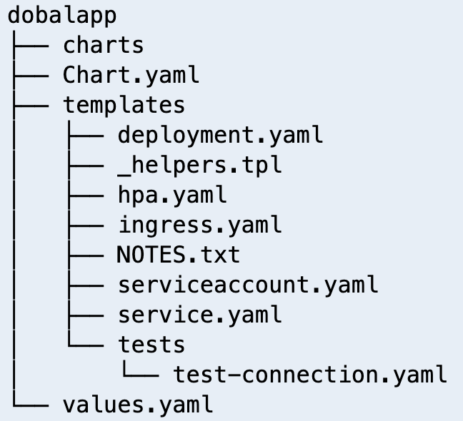

## Helm

### Introduction
* 서비스를 배포하기 위해 xxx-deployment.yaml, xxx-service.yaml, xxx-configmap.yaml, xxx-ingress.yaml 을 반복적으로 생성/배포 해야 함
* 대부분의 구조는 유사, 특히 dev/stage/prod 환경 배포시 약간만 다른 yaml들 파일 필요.
* 신규 서비스 생성시 복붙신공 후, 편집하여 사용하기도 함 --> 여러 파일 중, 하나의 편집을 누락할 경우 대환장 게이트 오픈
* 서비스가 많아질 수록 yaml 파일 관리가 어려워짐
* 리소스들을 하나의 논리적 배포 단위로 패키징하고 관리해주는 솔루션이 helm
* "우리는 그 논리적 배포 단위를 차트(chart)라고 부르기로 했어요"
* char는 k8s 리소스를 설명하는 파일 및 템플릿의 모음
* 웹 서비스를 배포한다고 할 때, 서비스/앱플리케이션/프록시 등을 모두 담아 chart로 만들어 사용
* 동일한 류의 애플리케이션 배포를 위해 템플릿화하여 찍어내듯 yaml 파일을 동적으로 생성 가능
* 애플리케이션을 배포하는 동안 pre/post 작업 가능

### helm 명령어
| **명령어**      | **의미**                            |
|--------------|-----------------------------------|
| helm search  | helm hub 및 helm repositories의 차트 검색 |
| helm install | chart 설치                          |
| helm show    | chat에 대한 정보 출력                    |
| helm repo    | repository의 추가, 삭제, 업데이트 등        |
| helm pull    | chart 다운로드                        |
| helm list    | 모든 릴리즈 나열                         |
| helm upgrade | 릴리즈된 차트의 새 버전 배포                  |
| helm history | 릴리즈된 차트의 기록                       |

```shell
helm show chart bitnami/nginx
helm show values bitnami/nginx
```
### nginx 배포
```shell
helm repo add bitnami https://charts.bitnami.com/bitnami
helm repo update
```
```shell
helm search repo postgresql
```
```shell
echo $NGINX_CHART_VERSION
helm install nginx bitnami/nginx \
  --version $NGINX_CHART_VERSION \
  --namespace nginx --create-namespace --wait
```
```shell
helm list -A
kubectl get pod -n nginx
```
```shell
helm upgrade --install nginx bitnami/nginx \
  --version $NGINX_CHART_VERSION \
  --namespace nginx --create-namespace --wait \
  --set replicaCount=3 \
  --values ~/environment/eks-workshop/modules/introduction/helm/values.yaml
```
```shell
kubectl get all -n nginx
```
```shell
helm history nginx -n nginx
```
### uninstall nginx
```shell
helm uninstall nginx --namespace nginx --wait
```

### nginx chart 살펴보기
```shell
helm pull bitnami/nginx
tar zxvf ./nginx-18.1.7.tgz
```

## Helm chart 만들기

* `helm create [chart_name]` 명령어로 신규 차트 생성
* **chart.yaml** 차드에 대한 정보
* **values.yaml** 차트의 변수와 기본 값 
* **charts/** 의존성 차트들이 위치 하는 디렉토리
* **templates/** 템플릿 파일이 위치 하는 디렉토리
* **templates/NOTES.TXT** chart를 설칳할 때 보여주는 도움말 텍스트

### myapp chart 생성
```shell
helm create myapp
tree myapp
```
```shell
rm -rf myapp/templates/*.yaml 
rm -rf myapp/templates/*.txt
rm -rf myapp/templates/*.tpl
rm -rf myapp/templates/tests
rm -rf myapp/Chart.yaml
tree myapp
```

#### deployment.yaml 파일 생성
```shell
cat << EOF > myapp/templates/deployment.yaml
apiVersion: apps/v1
kind: Deployment
metadata:
  labels:
    app: myapp
  name: myapp
  namespace: default
spec:
  replicas: 1
  selector:
    matchLabels:
      app: "myapp"
  template:
    metadata:
      labels:
        app: "myapp"
    spec:
      containers:
      - image: "nginx:latest"
        name: "myapp"
        ports:
        - containerPort: 80
          protocol: TCP
EOF
```
#### service.yaml 파일 생성
```shell
cat << EOF > myapp/templates/service.yaml
apiVersion: v1
kind: Service
metadata:
  labels:
    app: myapp
  name: myapp
  namespace: default
spec:
  ports:
  - port: 80
    protocol: TCP
    targetPort: 80
  selector:
    app: "myapp"
  type: "NodePort"
EOF
```
#### chart.yaml 파일 생성
```shell
cat << EOF > myapp/Chart.yaml
apiVersion: v2
name: myapp
description: My first helm app
type: application
version: 0.1.0
appVersion: "1.16.0"
EOF
```
#### myapp 설치
```shell
helm install myapp ./myapp
```
```shell
helm list
kubectl get all -n default
kubectl -n default exec -it deployment/myapp -- curl myapp.default.svc
```

### 변수 이용하기
#### values.yaml 파일 수정
```shell
cat << EOF > myapp/values.yaml
replicaCount: 3

image:
  repository: nginx
  pullPolicy: IfNotPresent
  tag: "latest"
service:
  type: NodePort
EOF
```
#### deployment.yaml 파일 수정
```shell
cat << EOF > ./myapp/templates/deployment.yaml
apiVersion: apps/v1
kind: Deployment
metadata:
  labels:
    app: myapp
  name: myapp
  namespace: default
spec:
  replicas: {{.Values.replicaCount}}
  selector:
    matchLabels:
      app: "{{.Chart.Name}}"
  template:
    metadata:
      labels:
        app: "{{.Chart.Name}}"
    spec:
      containers:
        - image: "{{.Values.image.repository}}:{{.Values.image.tag}}"
          name: "{{.Chart.Name}}"
          ports:
            - containerPort: 80
              protocol: TCP
EOF
```
#### service.yaml 파일 수정
```shell
cat << EOF > ./myapp/templates/service.yaml
apiVersion: v1
kind: Service
metadata:
  labels:
    app: myapp
  name: myapp
  namespace: default
spec:
  ports:
    - port: 80
      protocol: TCP
      targetPort: 80
  selector:
    app: "{{.Chart.Name}}"
  type: "{{.Values.service.type}}"
EOF
```
#### myapp update
```shell
helm upgrade myapp ./myapp
```
```shell
helm list
kubectl get all -n default
kubectl -n default exec -it deployment/myapp -- curl myapp.default.svc
```
* **[Quiz]** myapp 삭제하기