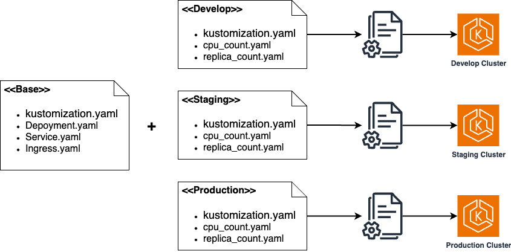

## Kustomize
* 텡플릿을 사용하지 않고 yaml 파일 만으로 구성 파일들을 커스터마이징
* 커스터마이징을 더 쉽게 할 수 있도록 생성기와 같은 여러 편리한 방법들 제공
* 기존 표준 구성 파일의 변경 없이 패치를 이용하여 환경별 변경 적용
* Kubernetes 1.14버전부터 kubectl에 빌트인 : -k option

### Overlay를 이용한 다양한 구성


### 기본 사용법
* 리소스를 정의한 yaml파일들과 같은 위치에 kustomization.yaml 파일 생성
* kustomization.yaml 파일에 변경 적용할 리소스 파일 목록 추가 또는 인라인 작성
* build 옵션으로 최종 yaml 생성
* kubectl apply 명령어를 이용하여 바로 적용 가능

```shell
# kustomize 명령어를 이용하는 방법
kustomize build ~/someapp
kustomize build ~/someapp | kubectl apply -f -

# 1.14버전 이후에는 kubectl에 built-in
kubectl apply -k ~/someapp
```

### Overlay 적용 예시
```shell
# base 적용 또는 초기화
kustomize build ~/someapp/base | kubectl apply -f -

# base + develop 환경 적용
kustomize build ~/someapp/overlays/develop | kubectl apply -f -

# base + production 환경 적용
kustomize build ~/someapp/overlays/production | kubectl apply -f -
```

### Overlay 적용 예시 - kubectl 1.14버전 이후
```shell
# base 적용 또는 초기화
kubectl apply -k ~/someapp/base

# base + develop 환경 적용
kubectl apply -k ~/someapp/overlays/develop

# base + production 환경 적용
kubectl apply -k ~/someapp/overlays/production
```


