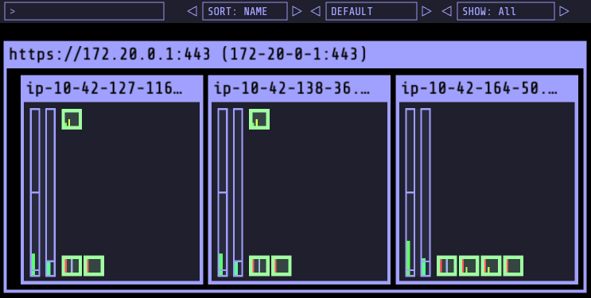

## Kube Opes View Install

```
cd ~/environment
git clone https://github.com/dobal-production/eksworkshop-custom.git
cd ~/environment/eksworkshop-custom/introduction/setup/05.kube-ops-view
WSParticipantRole:~/environment/eksworkshop-custom/introduction/setup/05.kube-ops
. 05.05.kube-ops-view-clb.sh
```



