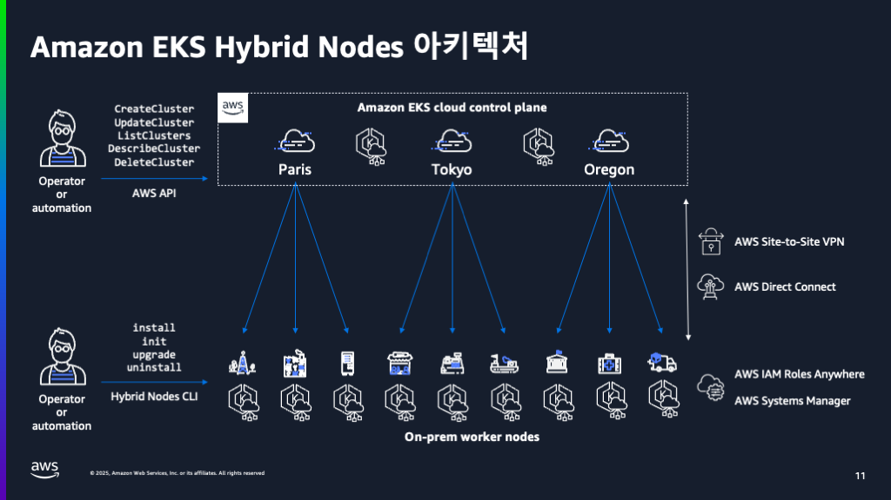
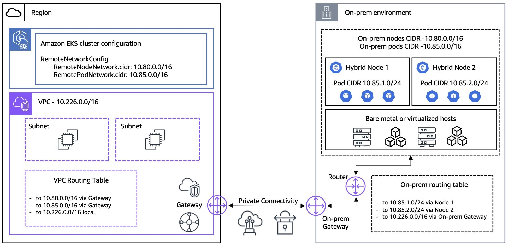
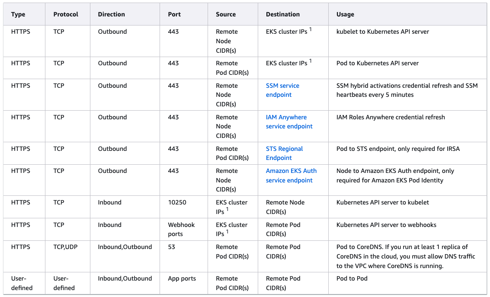
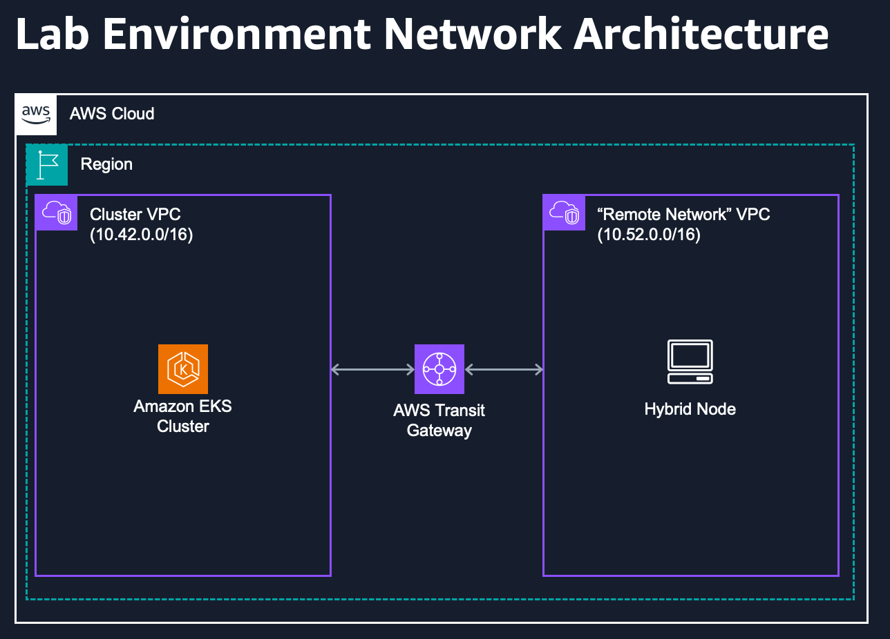
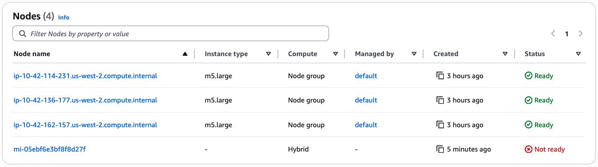
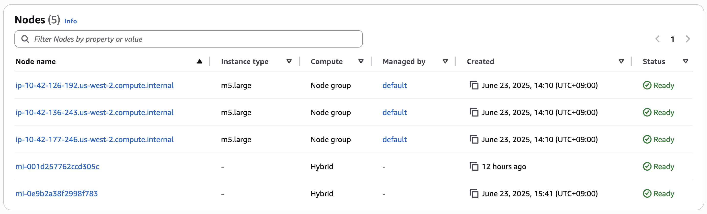
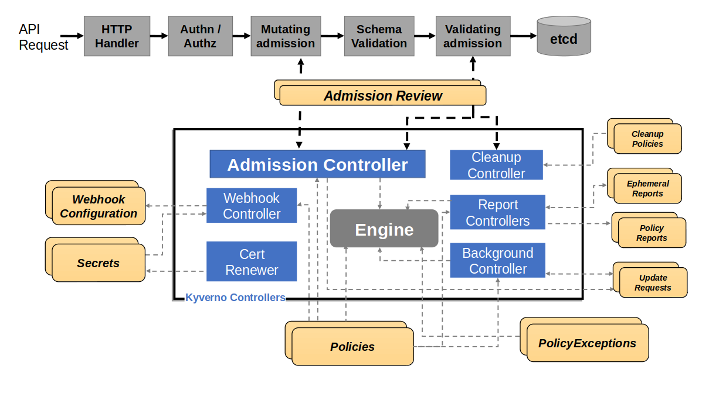

# Amazon EKS Hybrid Node




* 온프레미스 노드에 AWS SSM hybrid activation 또는 AWS IAM Role Anywhere를 활성화 해야 함.
* 실습에서는 SSM hybrid activation 사용
* 최소 100 Mbps, 최대 200ms 네트워크 레이턴시
* 온프레미스의 노드 및 파드의 CIDR가 미리 확보되어야 함.
* 하이브리드 노드에서 Kubernetes 웹후크를 실행하는 경우 포드 CIDR을 추가로 구성해야 함. 예를 들어 AWS Distro for Open Telemetry(ADOT)는 웹후크를 사용
* hybrid 노드 설치와 업그레이드를 위해 접근을 허용해야 하는 도메인 [[참고](https://docs.aws.amazon.com/ko_kr/eks/latest/userguide/hybrid-nodes-networking.html#hybrid-nodes-networking-on-prem)] 

  |    Component    | URL                      | Protocal | Port |
  |-----------------|--------------------------|----------|------|
  | EKS node artifacts (S3)        | https://hybrid-assets.eks.amazonaws.com    | HTTPS | 443 |
  | EKS service endpoints          | https://eks.region.amazonaws.com           | HTTPS | 443 |
  | ECR service endpoints          | https://api.ecr.region.amazonaws.com       | HTTPS | 443 |
  | EKS ECR endpoints              | [Amazon container image registries for Amazon EKS add-ons](https://docs.aws.amazon.com/eks/latest/userguide/add-ons-images.html) for regional endpoints.        | HTTPS | 443 |
  | SSM binary endpoint            | https://amazon-ssm-region.s3.region.amazonaws.com        | HTTPS | 443 |
  | SSM service endpoints          | https://ssm.region.amazonaws.com           | HTTPS | 443 |
  | EKS service endpoints          | https://eks.region.amazonaws.com           | HTTPS | 443 |
  | IAM Anywhere binary endpoint   | https://rolesanywhere.amazonaws.com        | HTTPS | 443 |
  | IAM Anywhere service endpoint  | https://rolesanywhere.region.amazonaws.com | HTTPS | 443 |
* hybrid 노드 운영을 위해 온프레미스 방화벽에서 허용해야 할 네트워크 액세스 [[참고](https://docs.aws.amazon.com/ko_kr/eks/latest/userguide/hybrid-nodes-networking.html#hybrid-nodes-networking-on-prem)]
  


### Hybrid 노드에서 사용할 IAM role에 필요한 권한들 [[참고](https://docs.aws.amazon.com/ko_kr/eks/latest/userguide/hybrid-nodes-creds.html)]
* **하이브리드 노드 CLI(nodeadm) 권한:**
  * eks:DescribeCluster 액션 필요
  * 클러스터 정보 수집에 사용
  * 이 권한이 없는 경우, nodeadm init 실행 시 수동으로 다음 정보를 제공해야 함:
    * Kubernetes API 엔드포인트
    * 클러스터 CA 번들
    * 서비스 IPv4 CIDR
* **kubelet 권한:**
  * Amazon ECR 접근을 위한 AmazonEC2ContainerRegistryPullOnly 권한 필요
  * 컨테이너 이미지 가져오기 용도
* **Systems Manager 사용 시 추가 권한:**
  * AmazonSSMManagedInstanceCore 정책에 정의된 하이브리드 활성화 권한
  * ssm:DeregisterManagedInstance 액션 권한
  * ssm:DescribeInstanceInformation 액션 권한
  * nodeadm uninstall 시 인스턴스 등록 해제에 필요

### Amazon EKS Hybrid Nodes CLI(`nodeadm`) 설치
* **`nodeadm` 다운로드**
  > x86_64
  ```shell
  curl -OL 'https://hybrid-assets.eks.amazonaws.com/releases/latest/bin/linux/amd64/nodeadm'
  ```
  > ARM
  ```shell
  curl -OL 'https://hybrid-assets.eks.amazonaws.com/releases/latest/bin/linux/arm64/nodeadm'
  ```
* **`nodeadm`에 실행권한 필요**
  * `chmod +x nodeadm`
  * `nodeadm`은 root 권한으로 실행해야 함
* **Amazon EKS 클러스터 조인을 위한 아티팩트 및 종속성 설치**
  ```shell
  nodeadm install 1.32 --credential-provider ssm
  ```
* **Amazon EKS 클러스터 조인**
  ```shell
  nodeadm init -c file://nodeConfig.yaml
  ```

### SSM hybrid activation vs IAM Role Anywhere
|      항목      | SSM hybrid activation | IAM Role Anywhere |
|----------------|-----------------------|-------------------|
| 사용 목적 | 온프레미스/엣지 디바이스를 AWS Systems Manager에 등록하여 관리형 인스턴스로 운영 | 온프레미스/외부 워크로드가 AWS 리소스에 접근할 때 X.509 인증서 기반의 임시 보안 인증 제공 |
| 인증 방식 | Activation 코드와 ID를 사용한 초기 등록 방식 | X.509 인증서를 사용한 상호 TLS 인증 |
| 접근 범위 | Systems Manager 기능을 통한 시스템 관리에 국한 | AWS 서비스 전반에 대한 접근 권한 제어 가능 |
| 주요 용도 | 패치 관리, 인벤토리 수집, 원격 명령 실행 등 시스템 관리 | CI/CD 파이프라인, 애플리케이션의 AWS 리소스 접근 |
| 보안 토큰 | Systems Manager 서비스에 특화된 관리 토큰 사용 | AWS STS를 통한 임시 보안 토큰 발급 |
| 선택 기준 | 시스템 관리 목적 | AWS 서비스 전반의 접근이 필요 |

## Lab Overview


## Connect Hybrid Node
* Amazon EKS Hybrid Node는 임시 IAM 자격 증명을 사용. 
* AWS SSM hybrid activation 또는 AWS IAM Roles Anywhere를 사용.

**본 실습에서는 AWS SSM hybrid activation을 사용**
* Activation Code와 Activation ID는 24시간후에 만료되며, 최대 30일까지 설정 가능
* 생성시 한 번만 표시되며, 나중에 다시 확인할 수 없음
* Hybrid 노드에서 사용할 IAM Role을 미리 생성해 두어야 함
* 노드를 클러스터에 등록시 사용

```shell
export ACTIVATION_JSON=$(aws ssm create-activation \
--default-instance-name hybrid-ssm-node \
--iam-role $HYBRID_ROLE_NAME \
--registration-limit 1 \
--region $AWS_REGION)
export ACTIVATION_ID=$(echo $ACTIVATION_JSON | jq -r ".ActivationId")
export ACTIVATION_CODE=$(echo $ACTIVATION_JSON | jq -r ".ActivationCode")

```

```yaml
apiVersion: node.eks.aws/v1alpha1
kind: NodeConfig
spec:
  cluster:
    name: $EKS_CLUSTER_NAME
    region: $AWS_REGION
  hybrid:
    ssm:
      activationCode: $ACTIVATION_CODE
      activationId: $ACTIVATION_ID
```

**환경변수를 nodeconfig.yaml 파일에 입력**
> `envsubst`명령어를 이용하여 변수 문자열 치환

```shell
cat ~/environment/eks-workshop/modules/networking/eks-hybrid-nodes/nodeconfig.yaml \
| envsubst > nodeconfig.yaml
```

```yaml
apiVersion: node.eks.aws/v1alpha1
kind: NodeConfig
spec:
  cluster:
    name: eks-workshop
    region: us-west-2
  hybrid:
    ssm:
      activationCode: 4L+tWgQj/is+qKabz7tk
      activationId: 99e29ad2-4ab8-4659-97db-a2da67f15245
```

**hybrid 대상 인스턴스에 nodeconfig 파일 업로드**
```shell
mkdir -p ~/.ssh/
ssh-keyscan -H $HYBRID_NODE_IP &> ~/.ssh/known_hosts
scp -i private-key.pem nodeconfig.yaml ubuntu@$HYBRID_NODE_IP:/home/ubuntu/nodeconfig.yaml
```

**`nodeadm`을 이용하여 Hybrid Nodes 관련 파일들 설치 (몇 분이 소요됨)**
```shell
ssh -i private-key.pem ubuntu@$HYBRID_NODE_IP \
"sudo nodeadm install $EKS_CLUSTER_VERSION --credential-provider ssm"
```
```shell
ec2-user:~/environment:$ ssh -i private-key.pem ubuntu@$HYBRID_NODE_IP \
"sudo nodeadm install $EKS_CLUSTER_VERSION --credential-provider ssm"
{"level":"info","ts":"2025-07-01T04:12:53.024Z","caller":"install/install.go:92","msg":"Creating package manager..."}
{"level":"info","ts":"2025-07-01T04:12:53.025Z","caller":"install/install.go:101","msg":"Validating Kubernetes version","kubernetes version":"1.31"}
{"level":"info","ts":"2025-07-01T04:12:53.712Z","caller":"install/install.go:107","msg":"Using Kubernetes version","kubernetes version":"1.31.7"}
{"level":"info","ts":"2025-07-01T04:12:53.712Z","caller":"flows/install.go:43","msg":"Configuring package manager. This might take a while..."}
{"level":"info","ts":"2025-07-01T04:12:53.712Z","caller":"flows/install.go:65","msg":"Installing containerd..."}
{"level":"info","ts":"2025-07-01T04:13:00.169Z","caller":"flows/install.go:70","msg":"Installing iptables..."}
{"level":"info","ts":"2025-07-01T04:13:00.169Z","caller":"flows/install.go:88","msg":"Installing SSM agent installer..."}
{"level":"info","ts":"2025-07-01T04:13:00.170Z","caller":"ssm/source.go:110","msg":"Downloading SSM installer","region":"us-west-2","url":"https://amazon-ssm-us-west-2.s3.us-west-2.amazonaws.com/latest/debian_amd64/ssm-setup-cli"}
{"level":"info","ts":"2025-07-01T04:13:11.900Z","caller":"flows/install.go:104","msg":"Installing kubelet..."}
{"level":"info","ts":"2025-07-01T04:13:12.499Z","caller":"flows/install.go:113","msg":"Installing kubectl..."}
{"level":"info","ts":"2025-07-01T04:13:12.787Z","caller":"flows/install.go:122","msg":"Installing cni-plugins..."}
{"level":"info","ts":"2025-07-01T04:13:13.885Z","caller":"flows/install.go:131","msg":"Installing image credential provider..."}
{"level":"info","ts":"2025-07-01T04:13:13.992Z","caller":"flows/install.go:140","msg":"Installing IAM authenticator..."}
{"level":"info","ts":"2025-07-01T04:13:14.306Z","caller":"flows/install.go:60","msg":"Finishing up install..."}
```

**앞서 업로드한 nodeconfig 파일로 초기화**
```shell
ssh -i private-key.pem ubuntu@$HYBRID_NODE_IP \
"sudo nodeadm init -c file://nodeconfig.yaml"
```

<details>
<summary>로그 보기</summary>

```shell
ec2-user:~/environment:$ ssh -i private-key.pem ubuntu@$HYBRID_NODE_IP \
"sudo nodeadm init -c file://nodeconfig.yaml"
{"level":"info","ts":"2025-07-01T04:15:06.951Z","caller":"init/init.go:62","msg":"Checking user is root.."}
{"level":"info","ts":"2025-07-01T04:15:06.952Z","caller":"init/init.go:76","msg":"Loading installed components"}
{"level":"info","ts":"2025-07-01T04:15:07.212Z","caller":"init/init.go:92","msg":"Validating firewall ports for cilium and calico"}
{"level":"info","ts":"2025-07-01T04:15:07.306Z","caller":"node/node.go:13","msg":"Loading configuration..","configSource":"file://nodeconfig.yaml"}
{"level":"info","ts":"2025-07-01T04:15:07.307Z","caller":"node/node.go:23","msg":"Setting up hybrid node provider..."}
{"level":"info","ts":"2025-07-01T04:15:07.310Z","caller":"hybrid/validator.go:60","msg":"Validating configuration..."}
{"level":"info","ts":"2025-07-01T04:15:07.310Z","caller":"flows/init.go:31","msg":"Configuring Aws..."}
{"level":"info","ts":"2025-07-01T04:15:07.310Z","caller":"ssm/config.go:44","msg":"Registering machine with SSM agent"}
{"level":"info","ts":"2025-07-01T04:15:08.004Z","caller":"ssm/config.go:66","msg":"Machine registered with SSM, assigning instance ID as node name","instanceID":"mi-05ebf6e3bf8f8d27f"}
{"level":"info","ts":"2025-07-01T04:15:08.005Z","caller":"ssm/daemon.go:71","msg":"Restarting SSM agent..."}
{"level":"info","ts":"2025-07-01T04:15:08.013Z","caller":"ssm/daemon.go:81","msg":"Waiting for SSM agent to be running..."}
{"level":"info","ts":"2025-07-01T04:15:08.014Z","caller":"ssm/daemon.go:85","msg":"SSM agent is running"}
{"level":"info","ts":"2025-07-01T04:15:08.014Z","caller":"hybrid/aws.go:34","msg":"Waiting for AWS config to be available"}
{"level":"info","ts":"2025-07-01T04:15:10.015Z","caller":"hybrid/configenricher.go:18","msg":"Enriching configuration..."}
{"level":"info","ts":"2025-07-01T04:15:10.015Z","caller":"hybrid/configenricher.go:25","msg":"Default options populated","defaults":{"sandboxImage":"602401143452.dkr.ecr.us-west-2.amazonaws.com/eks/pause:3.5"}}
{"level":"info","ts":"2025-07-01T04:15:10.196Z","caller":"hybrid/configenricher.go:32","msg":"Cluster details populated","cluster":{"name":"eks-workshop","region":"us-west-2","apiServerEndpoint":"https://5DF22373D2D41BC5BDE0F83785EB7F2E.gr7.us-west-2.eks.amazonaws.com","certificateAuthority":"LS0tLS1CRUdJTiBDRVJUSUZJQ0FURS0tLS0tCk1JSURCVENDQWUyZ0F3SUJBZ0lJWkIxYXpwSkFBSVF3RFFZSktvWklodmNOQVFFTEJRQXdGVEVUTUJFR0ExVUUKQXhNS2EzVmlaWEp1WlhSbGN6QWVGdzB5TlRBM01ERXdNVE16TVRaYUZ3MHpOVEEyTWprd01UTTRNVFphTUJVeApFekFSQmdOVkJBTVRDbXQxWW1WeWJtVjBaWE13Z2dFaU1BMEdDU3FHU0liM0RRRUJBUVVBQTRJQkR3QXdnZ0VLCkFvSUJBUURLUXhxbVA0eE1ZNDFSMmxqdkJFUzVLSlQ3U0hsVTFlL3N5dGpzRThjb0F2ZUpVNklvNFNsenhqbFcKWUl2cVBNaGpUNXpyeVZTSkFUMWlocjQyWkdXOGQ3NkZtQkhnblVEQTRzTXcreEYreWY4VXdtTmJ0c0N1NE9oQwpxcmNzRU9TVUxmN0IraWkrVTlmMm1DcHlrNE9NUUI5MVVzWS9lTFBlWTIvUW9UcVd0RkJvWktuVGZFNGpHcHR3ClFIVVl2Y1VxVmpzOW1TVU5vNDNUaWc4U0h6S0dES3MrR25lZ2p5MU9wZmVkOVA5THB5eWJlQ3dEYVltZWNhYmcKQXFOMStMVmNHbnhEY2FSQlk1SmlGUjBSL1dlR0g3emoweWVwNHh5ZWhBVEdYSzJDd09UMkw2WS8vYmNxRm9IUQpVM3NKU2ZSYmRPRVJSVktmSjNDRFRBN3ROUWhiQWdNQkFBR2pXVEJYTUE0R0ExVWREd0VCL3dRRUF3SUNwREFQCkJnTlZIUk1CQWY4RUJUQURBUUgvTUIwR0ExVWREZ1FXQkJSaW41bE5Mb3Z6TlNZaTd6Y3NnYnBZK1d0c2pUQVYKQmdOVkhSRUVEakFNZ2dwcmRXSmxjbTVsZEdWek1BMEdDU3FHU0liM0RRRUJDd1VBQTRJQkFRQnUwVEVDOTRDLwpBa2dTVGRnc0VBVlB3a2JxVWxmQ0hVYXFtZUh2MnpvTkxpcG9IUHNMM3R1a09XVGI3Y2FxWENLK3BQMFRlbEpvCkNnU0NnSzVIUEVZQng2NG0vL2xFckViamtVVGNQNi9qeVZwNE5hN2VmL0JwYmo5VDNzN01QZjJCd25EdmZvaEUKaFpYWjJlZGkyR2FPbGFNcUFqME40Y0xvZndOSUhjZmg1NlY0M04zWlZJV0hhRXVyczhMVXdkU3ZOK1dUb0RuMQo5TG8rbWVQT005UktNUWxvb3JRMGg2Z2hDMnR4T2RnR2c1Q3RldWFoQ1BMM2VYMDhRUVdhd2Z4SER3SkpicFYyCktvMkd4VFR5ZElqQTFRbGJuMGhEa25YUVR0ckk0bStyM1l5MzdUcEx5MGg5K1MxdlFXdm9WQ2xreHB3VHdqRmUKVEI0UWc4OFRtR0IvCi0tLS0tRU5EIENFUlRJRklDQVRFLS0tLS0K","cidr":"172.16.0.0/16"}}
{"level":"info","ts":"2025-07-01T04:15:10.196Z","caller":"hybrid/ip_validator.go:211","msg":"Validating Node IP..."}
{"level":"info","ts":"2025-07-01T04:15:10.196Z","caller":"hybrid/hybrid.go:101","msg":"Validating kubelet certificate..."}
{"level":"info","ts":"2025-07-01T04:15:10.196Z","caller":"flows/init.go:45","msg":"Setting up system aspects..."}
{"level":"info","ts":"2025-07-01T04:15:10.196Z","caller":"flows/init.go:48","msg":"Setting up system aspect..","name":"sysctl"}
{"level":"info","ts":"2025-07-01T04:15:10.198Z","caller":"flows/init.go:52","msg":"Finished setting up system aspect","name":"sysctl"}
{"level":"info","ts":"2025-07-01T04:15:10.198Z","caller":"flows/init.go:48","msg":"Setting up system aspect..","name":"swap"}
{"level":"info","ts":"2025-07-01T04:15:10.198Z","caller":"flows/init.go:52","msg":"Finished setting up system aspect","name":"swap"}
{"level":"info","ts":"2025-07-01T04:15:10.198Z","caller":"flows/init.go:48","msg":"Setting up system aspect..","name":"ports"}
{"level":"info","ts":"2025-07-01T04:15:10.262Z","caller":"system/ports.go:74","msg":"No firewall enabled on the host. Skipping setting firewall rules..."}
{"level":"info","ts":"2025-07-01T04:15:10.262Z","caller":"flows/init.go:52","msg":"Finished setting up system aspect","name":"ports"}
{"level":"info","ts":"2025-07-01T04:15:10.262Z","caller":"flows/init.go:64","msg":"Configuring Pre-process daemons..."}
{"level":"info","ts":"2025-07-01T04:15:10.262Z","caller":"flows/init.go:75","msg":"Configuring daemons..."}
{"level":"info","ts":"2025-07-01T04:15:10.262Z","caller":"flows/init.go:79","msg":"Configuring daemon...","name":"containerd"}
{"level":"info","ts":"2025-07-01T04:15:10.262Z","caller":"containerd/config.go:44","msg":"Writing containerd config to file..","path":"/etc/containerd/config.toml"}
{"level":"info","ts":"2025-07-01T04:15:10.262Z","caller":"flows/init.go:83","msg":"Configured daemon","name":"containerd"}
{"level":"info","ts":"2025-07-01T04:15:10.262Z","caller":"flows/init.go:79","msg":"Configuring daemon...","name":"kubelet"}
{"level":"info","ts":"2025-07-01T04:15:10.344Z","caller":"kubelet/config.go:371","msg":"Detected kubelet version","version":"v1.31.7"}
{"level":"info","ts":"2025-07-01T04:15:10.345Z","caller":"kubelet/config.go:460","msg":"Writing kubelet config to file..","path":"/etc/kubernetes/kubelet/config.json"}
{"level":"info","ts":"2025-07-01T04:15:10.388Z","caller":"flows/init.go:83","msg":"Configured daemon","name":"kubelet"}
{"level":"info","ts":"2025-07-01T04:15:10.388Z","caller":"flows/init.go:91","msg":"Ensuring daemon is running..","name":"containerd"}
{"level":"info","ts":"2025-07-01T04:15:10.400Z","caller":"containerd/daemon.go:64","msg":"Waiting for containerd to be running..."}
{"level":"info","ts":"2025-07-01T04:15:10.402Z","caller":"daemon/wait.go:25","msg":"Daemon is not in the desired state yet","daemon":"containerd","status":"unknown"}
{"level":"info","ts":"2025-07-01T04:15:15.402Z","caller":"containerd/daemon.go:68","msg":"containerd is running"}
{"level":"info","ts":"2025-07-01T04:15:15.402Z","caller":"flows/init.go:95","msg":"Daemon is running","name":"containerd"}
{"level":"info","ts":"2025-07-01T04:15:15.402Z","caller":"flows/init.go:97","msg":"Running post-launch tasks..","name":"containerd"}
{"level":"info","ts":"2025-07-01T04:15:15.402Z","caller":"containerd/sandbox.go:21","msg":"Looking up current sandbox image in containerd config.."}
{"level":"info","ts":"2025-07-01T04:15:15.446Z","caller":"containerd/sandbox.go:33","msg":"Found sandbox image","image":"602401143452.dkr.ecr.us-west-2.amazonaws.com/eks/pause:3.5"}
{"level":"info","ts":"2025-07-01T04:15:15.446Z","caller":"containerd/sandbox.go:35","msg":"Fetching ECR authorization token.."}
{"level":"info","ts":"2025-07-01T04:15:15.488Z","caller":"containerd/sandbox.go:49","msg":"Pulling sandbox image..","image":"602401143452.dkr.ecr.us-west-2.amazonaws.com/eks/pause:3.5"}
{"level":"info","ts":"2025-07-01T04:15:16.096Z","caller":"containerd/sandbox.go:54","msg":"Finished pulling sandbox image","image-ref":"sha256:6996f8da07bd405c6f82a549ef041deda57d1d658ec20a78584f9f436c9a3bb7"}
{"level":"info","ts":"2025-07-01T04:15:16.097Z","caller":"flows/init.go:101","msg":"Finished post-launch tasks","name":"containerd"}
{"level":"info","ts":"2025-07-01T04:15:16.097Z","caller":"flows/init.go:91","msg":"Ensuring daemon is running..","name":"kubelet"}
{"level":"info","ts":"2025-07-01T04:15:16.354Z","caller":"flows/init.go:95","msg":"Daemon is running","name":"kubelet"}
{"level":"info","ts":"2025-07-01T04:15:16.354Z","caller":"flows/init.go:97","msg":"Running post-launch tasks..","name":"kubelet"}
{"level":"info","ts":"2025-07-01T04:15:16.354Z","caller":"flows/init.go:101","msg":"Finished post-launch tasks","name":"kubelet"}
```
</details>

**Node 연결 확인, 그러나 노드는 `NotReady` 상태**
```shell
kubectl get nodes
```
```shell
NAME                                          STATUS     ROLES    AGE   VERSION
ip-10-42-126-192.us-west-2.compute.internal   Ready      <none>   91m   v1.31.3-eks-59bf375
ip-10-42-136-243.us-west-2.compute.internal   Ready      <none>   91m   v1.31.3-eks-59bf375
ip-10-42-177-246.us-west-2.compute.internal   Ready      <none>   91m   v1.31.3-eks-59bf375
mi-0e9b2a38f2998f783                          NotReady   <none>   19s   v1.31.7-eks-473151a
```



### cilium란?
* Cilium은 Kubernetes 클러스터를 위한 오픈소스 소프트웨어로, Linux 커널의 eBPF(extended Berkeley Packet Filter) 기술을 기반으로 하는 고성능 네트워킹, 보안 및 관찰 가능성 솔루션입니다.

### cilium을 사용하는 이유
1. **고급 네트워킹 기능**   
    * 고성능 Pod 간 통신: eBPF 기술을 활용하여 커널 수준에서 최적화된 네트워킹 제공
    * kube-proxy 대체: 기존 kube-proxy보다 효율적인 서비스 로드 밸런싱 제공
    * 멀티 클러스터 지원: 여러 클러스터 간의 원활한 네트워킹 가능
2. **강력한 보안 기능**
    * L3-L7 네트워크 정책: IP/포트 기반(L3/L4)뿐만 아니라 API 호출과 같은 애플리케이션 레이어(L7) 수준의 정책 지원
    * 신원 기반 보안: 서비스 간 통신을 IP 주소가 아닌 서비스 신원을 기반으로 제어
    * 투명한 암호화: Pod 간 통신의 자동 암호화를 통한 보안성 강화
3. **관찰 가능성(Observability)**
    * 네트워크 트래픽 가시화: 서비스 간 통신 흐름을 실시간으로 모니터링하고 시각화
    * 문제 해결 용이성: 네트워크 연결 문제를 빠르게 식별하고 해결
    * 성능 모니터링: 네트워크 성능 지표 제공
4. **클라우드 네이티브 환경 최적화**
    * EKS와 같은 관리형 쿠버네티스 서비스와의 통합: 클라우드 제공업체의 VPC와 원활하게 통합
    * 확장성: 대규모 클러스터에서도 효율적인 성능 제공
    * 자동화: 동적 환경에서 자동 구성 지원
5. **eBPF 기술의 이점**
    * 커널 수준 실행: 추가 컨테이너나 사이드카 없이 커널 수준에서 동작하여 오버헤드 최소화
    * 유연성: 커널 업그레이드 없이 네트워킹 스택 기능 확장 가능
    * 성능: 전통적인 네트워킹 솔루션보다 높은 처리량과 낮은 지연 시간

**cilium 애드온설치**
```shell
helm repo add cilium https://helm.cilium.io/
```
```shell
helm install cilium cilium/cilium \
--version 1.17.1 \
--namespace cilium \
--create-namespace \
--values ~/environment/eks-workshop/modules/networking/eks-hybrid-nodes/cilium-values.yaml
```

**cilium-values.yaml**
```yaml
# cilum 콤포넌트가 배포될 노드를 지정
affinity:
  nodeAffinity:
    requiredDuringSchedulingIgnoredDuringExecution:
      nodeSelectorTerms:
      - matchExpressions:
        - key: eks.amazonaws.com/compute-type
          operator: In
          values:
          - hybrid
# IP 주소관리(IPAM) 설정
ipam:
  mode: cluster-pool #Cilium이 클러스터 전체 IP 풀을 사용하여 IP 주소를 할당
  operator:
    clusterPoolIPv4MaskSize: 25 # 각 노드에 할당되는 서브넷 마스크 크기
    clusterPoolIPv4PodCIDRList: # 파드에 할당되는 IP 주소의 범위를 10.53.0.0/16으로 지정
    - 10.53.0.0/16
# cilium 오퍼레이터 설정
operator:
  replicas: 1 # cilium 오퍼레이터의 복제본 수를 1로 설정, default 2
  affinity:
    nodeAffinity: # 오퍼레이터도 hybrid 타입 노드에만 스케줄링
      requiredDuringSchedulingIgnoredDuringExecution:
        nodeSelectorTerms:
        - matchExpressions:
          - key: eks.amazonaws.com/compute-type
            operator: In
            values:
              - hybrid
  unmanagedPodWatcher: # 관리되지 않는 파드가 발견될 때 해당 파드를 재시작하지 않도록 설정
    restart: false
envoy:
  enabled: false

```

**cilium 설치 후, hybrid node는 `Ready` 상태가 됨**
```shell
kubectl get nodes

NAME                                          STATUS   ROLES    AGE     VERSION
ip-10-42-126-192.us-west-2.compute.internal   Ready    <none>   9h      v1.31.3-eks-59bf375
ip-10-42-136-243.us-west-2.compute.internal   Ready    <none>   9h      v1.31.3-eks-59bf375
ip-10-42-177-246.us-west-2.compute.internal   Ready    <none>   9h      v1.31.3-eks-59bf375
mi-0e9b2a38f2998f783                          Ready    <none>   7h53m   v1.31.7-eks-473151a
```



## Routing Traffic to Hybrid Nodes
**Sample workload 배포**
```yaml
apiVersion: apps/v1
kind: Deployment
metadata:
  name: nginx
  namespace: nginx-remote
  labels:
    app: nginx
spec:
  replicas: 3
  selector:
    matchLabels:
      app: nginx
  template:
    metadata:
      labels:
        app: nginx
    spec:
      affinity:
        nodeAffinity:
          preferredDuringSchedulingIgnoredDuringExecution:
            - weight: 1
              preference:
                matchExpressions:
                  - key: eks.amazonaws.com/compute-type
                    operator: In
                    values:
                      - hybrid
      containers:
        - name: nginx
          image: public.ecr.aws/nginx/nginx:1.26
          volumeMounts:
            - name: workdir
              mountPath: /usr/share/nginx/html
          resources:
            requests:
              cpu: 200m
            limits:
              cpu: 200m
          ports:
            - containerPort: 80
      initContainers:
        - name: install
          image: busybox:1.28
          command: [ "sh", "-c"]
          args:
            - 'echo "Connected to $(POD_IP) on $(NODE_NAME)" > /work-dir/index.html'
          env:
            - name: POD_IP
              valueFrom:
                fieldRef:
                  fieldPath: status.podIP
            - name: NODE_NAME
              valueFrom:
                fieldRef:
                  fieldPath: spec.nodeName
          volumeMounts:
            - name: workdir
              mountPath: "/work-dir"
      volumes:
        - name: workdir
          emptyDir: {}
  ```
  
  >**Hybrid 노드에 배포되도록 지정**  
  > `eks.amazonaws.com/compute-type=hybrid` 레이블/값 지정
```yaml
nodeAffinity:
  preferredDuringSchedulingIgnoredDuringExecution:
    - weight: 1
      preference:
        matchExpressions:
          - key: eks.amazonaws.com/compute-type
            operator: In
            values:
              - hybrid
```
```yaml

apiVersion: networking.k8s.io/v1
kind: Ingress
metadata:
  name: nginx
  namespace: nginx-remote
  annotations:
    alb.ingress.kubernetes.io/scheme: internet-facing
    alb.ingress.kubernetes.io/target-type: ip
spec:
  ingressClassName: alb
  rules:
    - http:
        paths:
          - path: /
            pathType: Prefix
            backend:
              service:
                name: nginx
                port:
                  number: 80
```
```shell
kubectl apply -k ~/environment/eks-workshop/modules/networking/eks-hybrid-nodes/kustomize
```
> **파드 확인**
```shell
kubectl get pods -n nginx-remote -o=custom-columns='NAME:.metadata.name,NODE:.spec.nodeName'
```
```shell
NAME                     NODE
nginx-787d665f9b-fr2g6   mi-0e9b2a38f2998f783
nginx-787d665f9b-r9fx7   mi-0e9b2a38f2998f783
nginx-787d665f9b-x882v   mi-0e9b2a38f2998f783
```

**배포된 ALB 확인**
```shell
export ADDRESS=$(kubectl get ingress -n nginx-remote nginx -o jsonpath="{.status.loadBalancer.ingress[*].hostname}{'\n'}") && echo $ADDRESS
curl -s $ADDRESS
```

**리소스 정리**
```shell
kubectl delete -k ~/environment/eks-workshop/modules/networking/eks-hybrid-nodes/kustomize --ignore-not-found=true
```

## Cloud Bursting
* `preferredDuringSchedulingIgnoredDuringExecution` 설정은 새로운 파드가 스캐쥴링 될 때는 hybrid 노드를 선호하도록 설정하지만, hybrid 노드에 더 이상 파드가 들어갈 공간이 없을 경우, 다른 노드를 사용할 수 있도록 허용
* 그런데, `IgnoredDuringExecution` 부분으로 인해 기존 실행중인 파드는 이 영향을 받지 않음
  * 파드가 scale-in 될 경우, 쿠버네티스는 가장 오래된 파드 먼저 삭제하려고 시도함.
  * hybrid 노드에 먼저 배포되므로, scale-in시 hybrid 노드에 있는 파드가 우선적으로 삭제될 것 --> 우리가 원치 않는 상황

### Kyverno


* 쿠버네티스와 클라우드 네이티브 환경을 위한 정책관리 도구
* yaml기반 선언적 정책 (Policy as Code, PaC)
* 쿠버네티스 네이티브 리소스로 관리
* kubectl, git, kustomize 등 기존 도구 활용 가능
* JMESPath와 CEL(Common Expressions Language) 지원
* **핵심기능**
  * 쿠버네티스 리소스 검증, 변경, 생성, 정리
  * OCI(Open Container Initiative) 컨테이너 이미지 서명 및 아티팩트 검증
* **도구 및 확장**
  * CLI : 오프라인 정책 테스트 및 적용(IaC, CI/CD 파이프라인)
  * Policy Reporter : 웹기반 GUI로 보고서 관리
  * JSON 지원 : K8S 외 환경에서도 정책 적용 가능

**`Kyverno` 설치**
```shell
helm repo add kyverno https://kyverno.github.io/kyverno/
helm install kyverno kyverno/kyverno --version 3.3.7 -n kyverno --create-namespace -f ~/environment/eks-workshop/modules/networking/eks-hybrid-nodes/kyverno/values.yaml
```

**클러스터 정책추가**
```yaml
apiVersion: kyverno.io/v1
kind: ClusterPolicy
metadata:
  name: set-pod-deletion-cost
  annotations:
    policies.kyverno.io/title: Set Pod Deletion Cost
    policies.kyverno.io/category: Pod Management
    policies.kyverno.io/severity: medium
    policies.kyverno.io/description: >-
      Sets pod-deletion-cost label on nginx pods scheduled to hybrid compute nodes.
spec:
  rules:
    - name: set-deletion-cost-for-nginx-on-hybrid
      match:
        any:
          - resources:
              kinds:
                - Pod/binding
      context:
        - name: node
          variable:
            jmesPath: request.object.target.name
            default: ""
        - name: computeType
          apiCall:
            urlPath: "/api/v1/nodes/{{node}}"
            jmesPath: metadata.labels."eks.amazonaws.com/compute-type" || 'empty'
      preconditions:
        all:
          - key: "{{ computeType }}"
            operator: Equals
            value: hybrid
      mutate:
        targets:
          - apiVersion: v1
            kind: Pod
            name: "{{ request.object.metadata.name }}"
            namespace: "{{ request.object.metadata.namespace }}"
        patchStrategicMerge:
          metadata:
            annotations:
              controller.kubernetes.io/pod-deletion-cost: "1"
```

**A. pod 바인딩 이벤트에만 적용**
```yaml
match:
  any:
    - resources:
        kinds:
          - Pod/binding
```

**B. 노드 이름과 `compute-type` 라벨 값을 변수 처리**
> `node`, `computType` 변수에 값 할당  
> `computType`은 api 호출을 통해 노드의 `compute-type`을 가져온다.
```yaml
context:
  - name: node
    variable:
      jmesPath: request.object.target.name
      default: ""
  - name: computeType
    apiCall:
      urlPath: "/api/v1/nodes/{{node}}"
      jmesPath: metadata.labels."eks.amazonaws.com/compute-type" || 'empty'

```

**C.조건**
> `compute-type=hybrid`인 경우에만 적용
```yaml
preconditions:
  all:
    - key: "{{ computeType }}"
      operator: Equals
      value: hybrid
```
**D. 변경규칙**
> 대상 파드에 `pod-deletion-code=1` 어노테이션 추가 
> 파드의 삭제 우선순위를 조정하여 높은 값을 가진 파드가 나중에 삭제되도록 설정
```yaml
mutate:
  targets:
    - apiVersion: v1
      kind: Pod
      name: "{{ request.object.metadata.name }}"
      namespace: "{{ request.object.metadata.namespace }}"
  patchStrategicMerge:
    metadata:
      annotations:
        controller.kubernetes.io/pod-deletion-cost: "1"

```

### `pod-deletion-cost`
* 값의 범위 : 정수 값, 음수/양수 설정 가능, 
* 설정되지 않으면 `0`
* 높은 값을 가진 파드가 더 나중에 삭제됨
* 같은 값을 가진 파드들 사이에서는 임의로 선택됨
* `ReplicaSet` 컨트롤러가 파드를 삭제할 때 이 값을 참고
