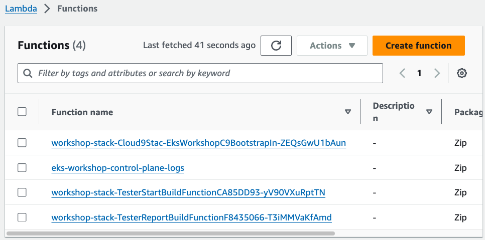
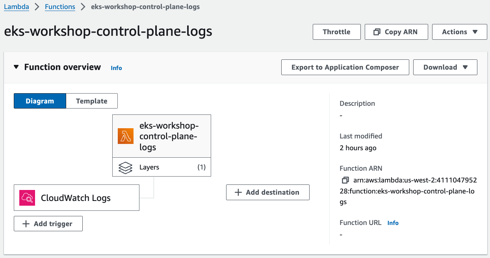

## Observability with OpenSearch
### Access OpenSearch
* Systems Manager > Parameter Store 에서 OpenSearch 관련 정보 추출
```shell
export OPENSEARCH_HOST=$(aws ssm get-parameter \
      --name /eksworkshop/$EKS_CLUSTER_NAME/opensearch/host \
      --region $AWS_REGION | jq .Parameter.Value | tr -d '"')
export OPENSEARCH_USER=$(aws ssm get-parameter \
      --name /eksworkshop/$EKS_CLUSTER_NAME/opensearch/user  \
      --region $AWS_REGION --with-decryption | jq .Parameter.Value | tr -d '"')
export OPENSEARCH_PASSWORD=$(aws ssm get-parameter \
      --name /eksworkshop/$EKS_CLUSTER_NAME/opensearch/password \
      --region $AWS_REGION --with-decryption | jq .Parameter.Value | tr -d '"')
export OPENSEARCH_DASHBOARD_FILE=~/environment/eks-workshop/modules/observability/opensearch/opensearch-dashboards.ndjson
```
```shell
curl -s https://$OPENSEARCH_HOST/_dashboards/auth/login \
      -H 'content-type: application/json' -H 'osd-xsrf: osd-fetch' \
      --data-raw '{"username":"'"$OPENSEARCH_USER"'","password":"'"$OPENSEARCH_PASSWORD"'"}' \
      -c dashboards_cookie | jq .
curl -s -X POST https://$OPENSEARCH_HOST/_dashboards/api/saved_objects/_import?overwrite=true \
        --form file=@$OPENSEARCH_DASHBOARD_FILE \
        -H "osd-xsrf: true" -b dashboards_cookie | jq .
```

* OpenSearch 대시보드 접속
```shell
printf "\nOpenSearch dashboard: https://%s/_dashboards/app/dashboards \nUserName: %q \nPassword: %q \n\n" \
      "$OPENSEARCH_HOST" "$OPENSEARCH_USER" "$OPENSEARCH_PASSWORD"
```

### Kubernetes Events
* K8S 이벤트는 1시간 동안만 유지
* `kubernetes-event-exporter`를 이용하여 로그를 OpenSearch로 전송
* 이벤트 정보는 OpenSearch의 `eks-kubernetes-events` 인덱스에 저장

```shell
helm install events-to-opensearch \
    oci://registry-1.docker.io/bitnamicharts/kubernetes-event-exporter \
    --namespace opensearch-exporter --create-namespace \
    -f ~/environment/eks-workshop/modules/observability/opensearch/config/events-exporter-values.yaml \
    --set="config.receivers[0].opensearch.username"="$OPENSEARCH_USER" \
    --set="config.receivers[0].opensearch.password"="$OPENSEARCH_PASSWORD" \
    --set="config.receivers[0].opensearch.hosts[0]"="https://$OPENSEARCH_HOST" \
    --wait
kubectl get pods -n opensearch-exporter
```

### Control plane logs
* 실습을 위해 CloudWatch 로그를 OpenSearch로 전송하는 람다를 미리 생성해 둠

1. control plane에서 CloudWatch logs로 로그 전송
2. CloudWatch logs 구독 필터가 람다 함수를 트리거하여 로그 메시지를 전송
3. 람다 함수가 로그를 OpenSaerch 인덱스에 기록
4. `eks-control-plane-logs` 인덱스에서 로그 조회

```shell
aws eks update-cluster-config \
    --region $AWS_REGION \
    --name $EKS_CLUSTER_NAME \
    --logging '{"clusterLogging":[{"types":["api","audit","authenticator","controllerManager","scheduler"],"enabled":true}]}'
sleep 30
aws eks wait cluster-active --name $EKS_CLUSTER_NAME
```

* `kube-apiserver-*` for Kubernetes API server logs
* `*-audit-*` for audit logs
* `authenticator-*` for authenticator logs
* `kube-controller-manager-*` for controller manager logs
* `kube-scheduler-*` for scheduler logs


* 람다 권한 매핑

```shell
curl -s -XPUT "https://${OPENSEARCH_HOST}/_plugins/_security/api/roles/lambda_role" \
    -u $OPENSEARCH_USER:$OPENSEARCH_PASSWORD -H 'Content-Type: application/json' \
    --data-raw '{"cluster_permissions": ["*"], "index_permissions": [{"index_patterns": ["eks-control-plane-logs*"], "allowed_actions": ["*"]}]}' \
    | jq .
curl -s -XPUT "https://${OPENSEARCH_HOST}/_plugins/_security/api/rolesmapping/lambda_role" \
    -u $OPENSEARCH_USER:$OPENSEARCH_PASSWORD -H 'Content-Type: application/json' \
    --data-raw '{"backend_roles": ["'"$LAMBDA_ROLE_ARN"'"]}' | jq .
```

* CloudWatch 구독 필터 생성
```shell
aws logs put-subscription-filter \
    --log-group-name /aws/eks/$EKS_CLUSTER_NAME/cluster \
    --filter-name "${EKS_CLUSTER_NAME}-Control-Plane-Logs-To-OpenSearch" \
    --filter-pattern "" \
    --destination-arn $LAMBDA_ARN
aws logs describe-subscription-filters \
    --log-group-name /aws/eks/$EKS_CLUSTER_NAME/cluster | jq .
```



### pod logging

* Fluent Bit의 데몬셋을 배포하여 OpenSearch로 로그 전송

```shell
helm repo add eks https://aws.github.io/eks-charts
helm upgrade fluentbit eks/aws-for-fluent-bit --install \
    --namespace opensearch-exporter --create-namespace \
    -f ~/environment/eks-workshop/modules/observability/opensearch/config/fluentbit-values.yaml \
    --set="opensearch.host"="$OPENSEARCH_HOST" \
    --set="opensearch.awsRegion"=$AWS_REGION \
    --set="opensearch.httpUser"="$OPENSEARCH_USER" \
    --set="opensearch.httpPasswd"="$OPENSEARCH_PASSWORD" \
    --wait
kubectl get daemonset -n opensearch-exporter
```

* ui 애플리케이션을 삭제 후, 재배포
```shell
kubectl delete pod -n ui --all
kubectl rollout status deployment/ui -n ui --timeout 30s
```
* 대시보드에서 pod 로깅 확인