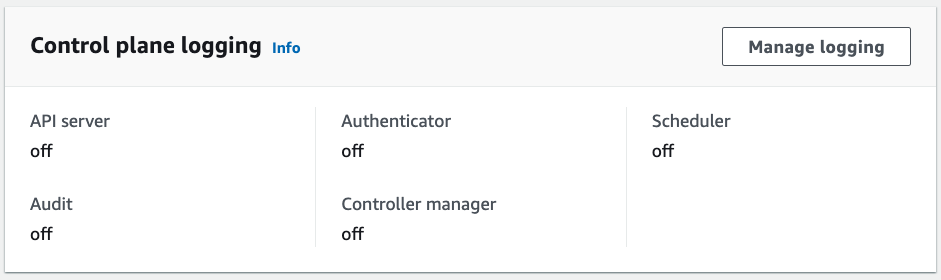
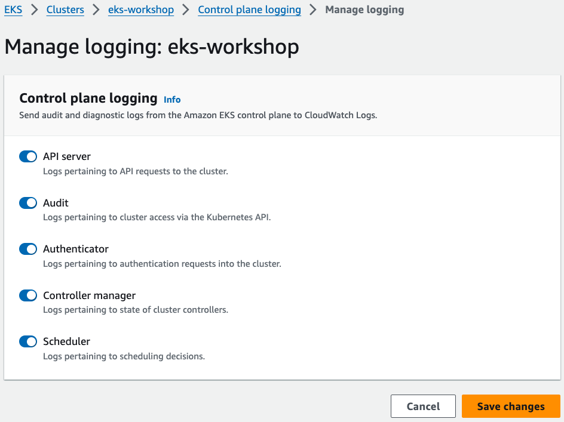
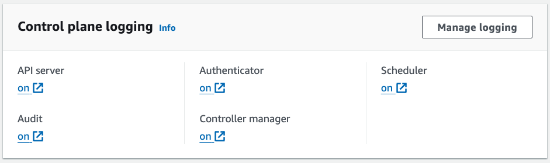
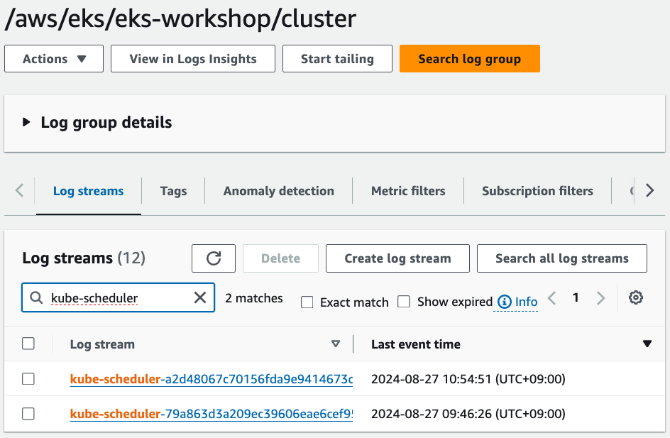
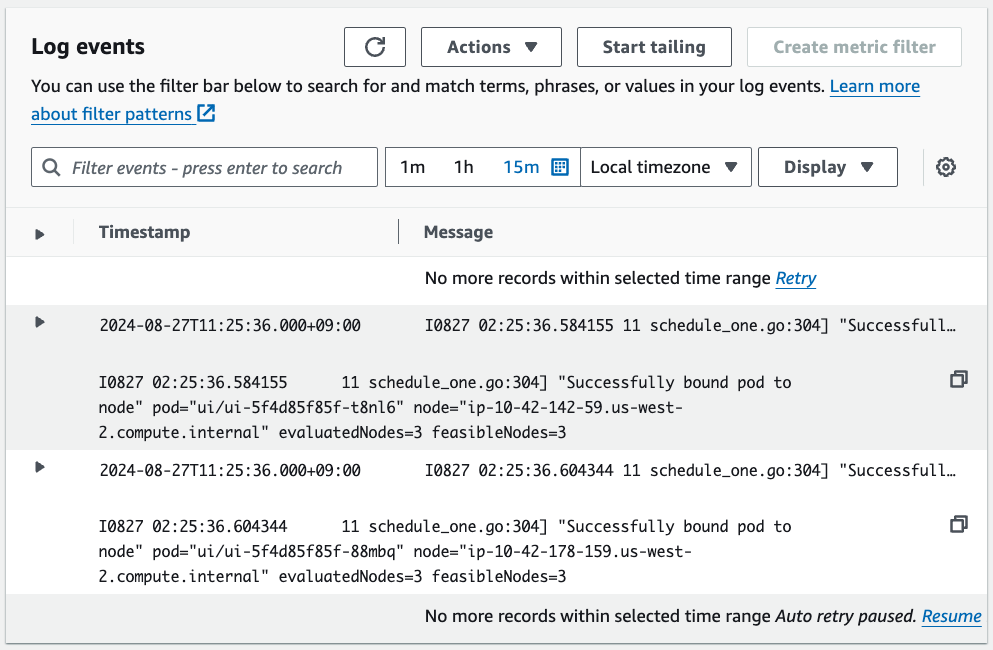
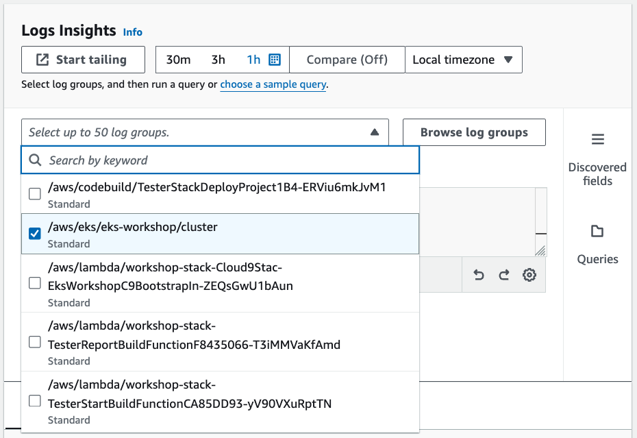
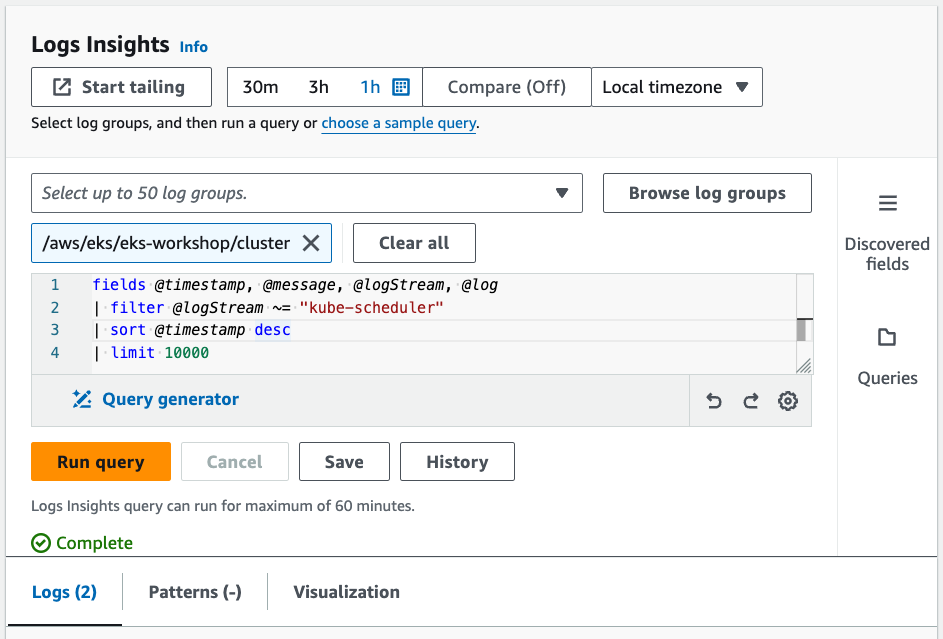
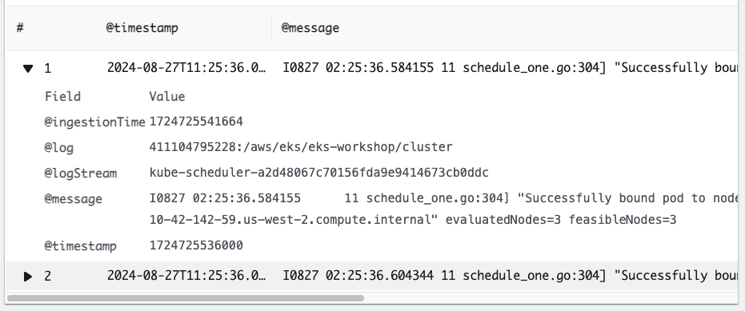

## Control plane logs
* Amazon EKS Control plane은 사용자 계정의 CloudWatch Logs로 직접 감사와 진단 로그를 제공
* 로그 타입을 선택할 수 있으며, 로그는 CloudWatch의 Amazon EKS 클러스터의 로그 그룹에 로그 스트림으로 전송됨
* `Kubernetes API server component logs (api)` API server log
* `Audit (audit)` 클러스터에 영향을 준 user, administrators, system components 들에 대한 로그
* `Authenticator (authenticator)` IAM 크리덴셜을 이용하는 K8S RBAC 인증 로그
* `Controller manager (controllerManager)` K8S내의 컨트롤러 관련 로그
* `Scheduler (scheduler)` 클러스터 내에서 pod를 실행할 시기와 위치(노드) 관련 로그

### Configuring control plane logs
* 로깅은 활성화 시켜주어야 함
* 실습 환경에서는 diabled 상태
* Console, AWS CLI, Terraform, CloudFormation 등으로 활성화 가능



```shell
aws eks update-cluster-config \
    --region $AWS_REGION \
    --name $EKS_CLUSTER_NAME \
    --logging '{"clusterLogging":[{"types":["api","audit","authenticator","controllerManager","scheduler"],"enabled":true}]}'
sleep 30
aws eks wait cluster-active --name $EKS_CLUSTER_NAME
```




### Viewing in CloudWatch
* ui의 리플리카를 3으로 늘린 후, CloudWatch Logs에서 Scheduler 로그 확인
```shell
kubectl scale -n ui deployment/ui --replicas=3
```



### CloudWatch Log Insights



```sql
fields @timestamp, @message, @logStream, @log
| filter @logStream ~= "kube-scheduler"
| sort @timestamp desc
| limit 10000
```

