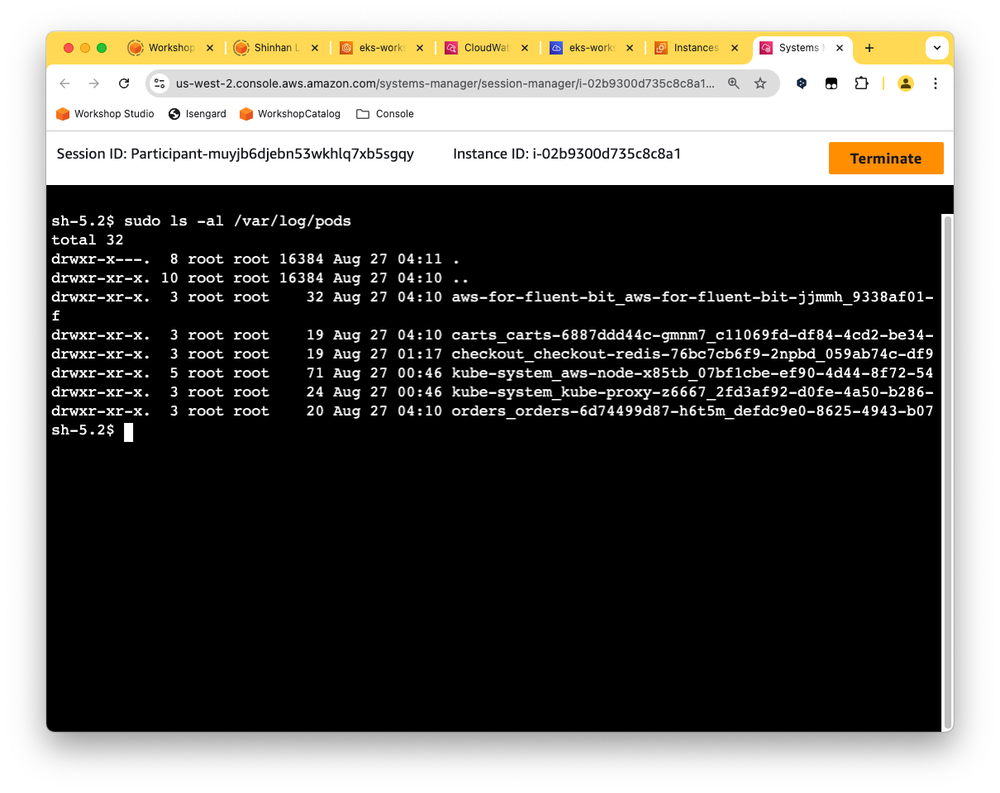

## Pod logging
* K8S는 로그 데이터를 위한 네이티브 솔루션을 제공하지 않아 외부의 솔루션과 연동해야 함
* 컨테이너화된 애플리케이션은 로그를 stdout/stderror로 출력해야 함. [The Twelve-Factor App - XI.Logs](https://12factor.net/logs)
* **Basic level logging** `kubectl`을 이용하여 pod들의 로그를 가져오기 
* **Node level logging** 컨테이너 엔진은 애플리케이션의 stdout/stderr 에서 로그를 캡쳐하고 로그파일에 기록
* **Cluster level logging** 노드 수준 로깅에 기반하여 로그를 캡처하는 에이전트가 로컬 파일 시스템의 로그를 수집하여 CloudWatch나 OpenSearch와 같은 중앙 로그 시스템으로 전송
  * 컨테이너 엔진에 의해 수집되는 컨테이너 로그
  * 시스렘 로그


### 노드 내 로그의 위치
* K8S에서 pod의 로그는 pod가 실행중인 Node에 저장
* `/var/log/pods/{namespace}_{pod_name}/{container-name}/{count-number}.log`
* `/var/log/containers/{pod_name}_{namespace}_{container-name}.log`
* EC2 > Node 선택 > Session Manager 접속하여 로그 위치 확인
```shell
sudo ls -al /var/log/pods
```
```shell
sudo ls -al /var/log/containers
```


### 로깅 패턴들


### Using Fluent Bit
* Fluent Bit은 다양한 소스에서 데이터와 로그를 수집하고 필터로 보강한 후, CloudWatch, Kinesis Data Firehose, Kinesis Data Streams, OpenSearch  등 여러 대상에 전송할 수 있는 경량 로그 처리 및 전송기
* AWS for Fluent Bit 이미지는 Amazon ECR Public Gallery에서도 제공
* Fluent Bit을 데몬셋으로 실행하여 컨테이너나 pod의 로그를 CloudWatch로 전송

```shell
kubectl get all -n aws-for-fluent-bit
```
* Fluent Bit의 설정은 ConfigMap에서 확인/변경 가능
```shell
kubectl describe configmaps -n aws-for-fluent-bit
```
```shell
Name:         aws-for-fluent-bit
Namespace:    aws-for-fluent-bit
Labels:       app.kubernetes.io/instance=aws-for-fluent-bit
              app.kubernetes.io/managed-by=Helm
              app.kubernetes.io/name=aws-for-fluent-bit
              app.kubernetes.io/version=2.28.4
              helm.sh/chart=aws-for-fluent-bit-0.1.24
Annotations:  meta.helm.sh/release-name: aws-for-fluent-bit
              meta.helm.sh/release-namespace: aws-for-fluent-bit

Data
====
fluent-bit.conf:
----
[SERVICE]
    Parsers_File /fluent-bit/parsers/parsers.conf
[INPUT]
    Name              tail
    Tag               kube.*
    Path              /var/log/containers/*.log
    DB                /var/log/flb_kube.db
    Parser            docker
    Docker_Mode       On
    Mem_Buf_Limit     5MB
    Skip_Long_Lines   On
    Refresh_Interval  10
[FILTER]
    Name                kubernetes
    Match               kube.*
    Kube_URL            https://kubernetes.default.svc.cluster.local:443
    Merge_Log           On
    Merge_Log_Key       data
    Keep_Log            On
    K8S-Logging.Parser  On
    K8S-Logging.Exclude On
    Buffer_Size         32k
[OUTPUT]
    Name                  cloudwatch_logs
    Match                 *
    region                us-west-2
    log_group_name        /eks-workshop/worker-fluentbit-logs-ZP9QUf
    log_group_template    /aws/eks/fluentbit-cloudwatch/workload/$kubernetes['namespace_name']
    log_stream_prefix     fluentbit-
    log_stream_template   $kubernetes['pod_name'].$kubernetes['container_name']
    auto_create_group     true
```

### Verify the logs in CloudWatch
* ui 서비스는 스프링 부트로  만들어진 애플리케이션
* ui 서비스를 재배포하여 스프링 부트 애플리케이션의 초기 로그를 확인

```.shell
kubectl delete pod -n ui --all
kubectl rollout status deployment/ui \
  -n ui --timeout 30s
```
```shell
kubectl logs -n ui deployment/ui
```


