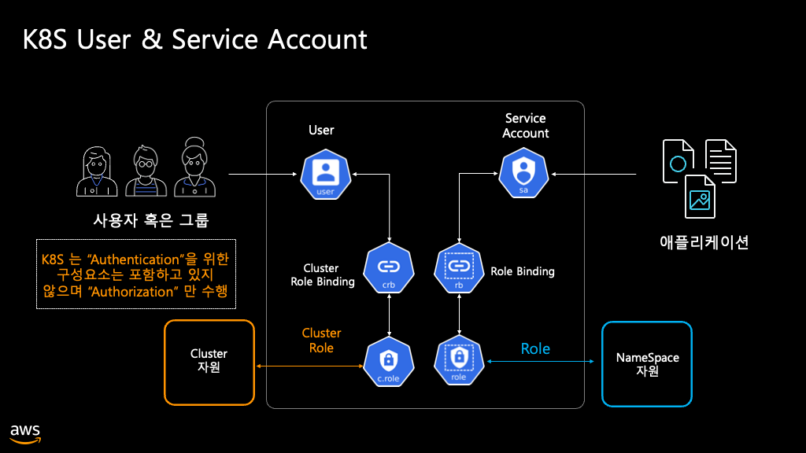
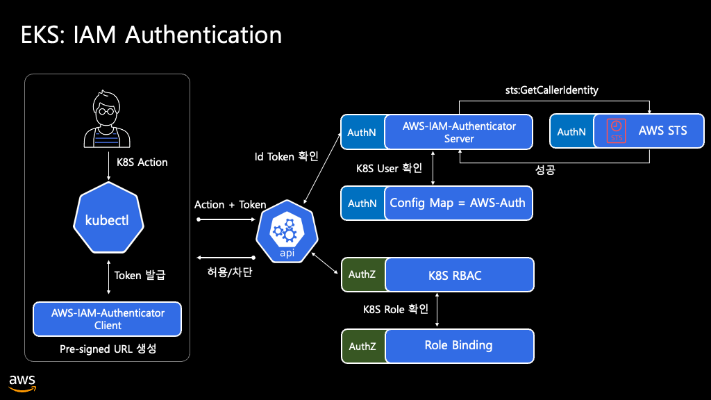
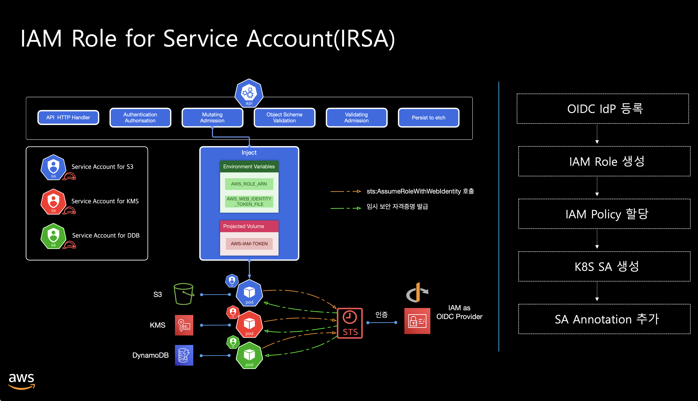
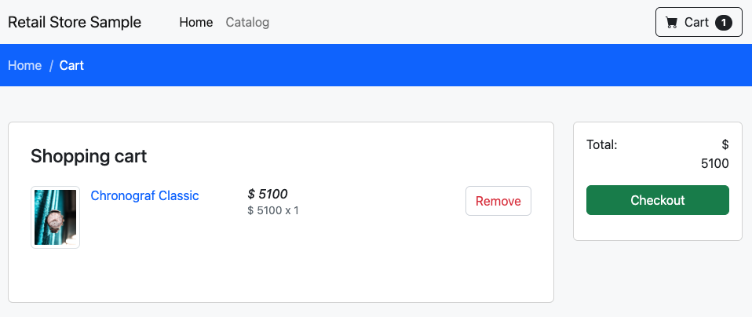
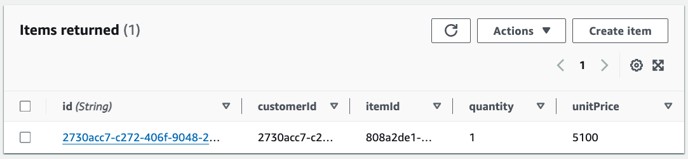

## Kubernetes RBAC(Role Based Access Control)
## IAM Roles for Service Account
* Pod안의 애플리케이션은 AWS IAM 권한을 이용하여 AWS Service의 API에 요청을 보낼 수 있음
* AWS API 요청에는 자격 증명으로 서명해야 함
* IAM Role for Service Accounts(IRSA)는 Amazon EC2의 Profile 처럼 애플리케이션에 자격증명을 관리할 수 있게 해줌
* Service Account에 AWS IAM 역할을 연결하고, pod들이 해당 sa를 사용하도록 설정
  




### Introduction
* carts 서비스는 데이터베이스로 [Amazon DynamoDB의 라이트버전](https://docs.aws.amazon.com/ko_kr/amazondynamodb/latest/developerguide/DynamoDBLocal.html)(로컬에서 실행 가능)을 사용
* Pod가 실행될 때, `kubelet`은 각 서비스의 환경변수를 추가 

```shell
kubectl -n carts get pod
```
```shell
kubectl -n carts exec deployment/carts -- env | grep CARTS
```
### Using DynamoDB
* ConfigMap에 설정된 DynamoDB 정보를 업데이트 하고 재배포
```shell
kubectl -n carts get -o yaml cm carts
```
```shell
echo $CARTS_DYNAMODB_TABLENAME
kubectl kustomize ~/environment/eks-workshop/modules/security/irsa/dynamo \
  | envsubst | kubectl apply -f-

kubectl get -n carts cm carts -o yaml
```
```shell
kubectl rollout restart -n carts deployment/carts
kubectl rollout status -n carts deployment/carts
```
```shell
kubectl -n carts get pod
```

### Understanding Pod IAM
* 기본적으로 Pod는 Worker Node에 지정된 AWS IAM Role을 이용
* 해당 Role에 AWS 리소스들에 대한 접근 권한이 없으면 Pod도 AWS 리소스에 접근할 수 없음
* 서비스들마다 사용하는 AWS 리소스들이 다르기 때문에 Worker Node의 IAM Role에 포괄적인 권한을 주는 것은 위험
* 이러한 문제를 해결하기 위한 방법 중 하나가 IAM Roles for Service Account(IRSA)

### Appling IRSA
* ServiceAccount를 위해 IAM Role을 사용하기 위해서는 IAM OIDC identity Provider가 있어야 함. 

```shell
aws iam list-open-id-connect-providers

aws eks describe-cluster --name ${EKS_CLUSTER_NAME} --query 'cluster.identity'

aws iam get-policy-version \
  --version-id v1 --policy-arn \
  --query 'PolicyVersion.Document' \
  arn:aws:iam::${AWS_ACCOUNT_ID}:policy/${EKS_CLUSTER_NAME}-carts-dynamo | jq .
```
```shell
# 'carts' Service Account 정보 조회
kubectl -n carts describe deployment carts | grep 'Service Account'
kubectl describe sa -n carts carts
```
```shell
# 'carts' Service Account에 IAM Role 정보 매핑
kubectl kustomize ~/environment/eks-workshop/modules/security/irsa/service-account \
  | envsubst | kubectl apply -f-
 
kubectl describe sa -n carts carts
```
```shell
kubectl rollout restart -n carts deployment/carts
kubectl rollout status -n carts deployment/carts
```

### Verifying DynamoDB Access
```shell
kubectl get service -n ui ui-nlb -o jsonpath="http://{.status.loadBalancer.ingress[*].hostname}"
```
```shell
# 환경변수 확인
kubectl -n carts exec deployment/carts -- env | grep AWS
```



