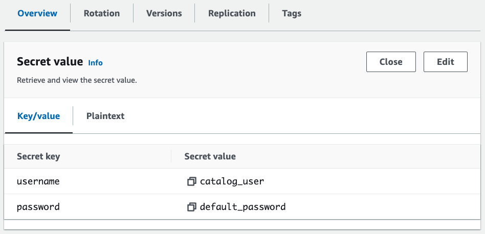

## Managing Secrets with AWS Secrets Manager
* pod에서 AWS Secrets Manager 와  AWS Systems Manager Parameter Store 를 볼륨으로 마운트시켜 사용 가능.
* 마운트된 볼륨을 k8s native secret이나 환경변수로 사용할 수 있음.
* k8s secrets store CSI(Container Storage Interface) driver로 AWS Secrets and Configuration Provider(ASCP) 사용.
* IRSA(IAM Role for a Service Account)를 이용하여 접근제어를 할 수 있음.

### Storing secrets in AWS Secrets Manager
```shell
# AWS Secrets 생성
export SECRET_SUFFIX=$(openssl rand -hex 4)
export SECRET_NAME="$EKS_CLUSTER_NAME-catalog-secret-${SECRET_SUFFIX}"
aws secretsmanager create-secret --name "$SECRET_NAME" \
  --secret-string '{"username":"catalog_user", "password":"default_password"}' --region $AWS_REGION
```


### AWS Secrets and Configuration Provider (ASCP)
* 관련 CSI 드라이버들을 데몬셋으로 배포 (미리 배포 되었음)
* od에서 AWS Secrets Manager 와  AWS Systems Manager Parameter Store 를 볼륨으로 마운트시켜 사용 가능.
* 마운트된 볼륨을 k8s native secret이나 환경변수로 사용할 수 있음.
```shell
kubectl -n secrets-store-csi-driver get pods,daemonsets -l app=secrets-store-csi-driver

kubectl -n kube-system get pods,daemonset -l "app=secrets-store-csi-driver-provider-aws"
```

```yaml
apiVersion: secrets-store.csi.x-k8s.io/v1
kind: SecretProviderClass
metadata:
  name: catalog-spc
  namespace: catalog
spec:
  provider: aws
  parameters:
    objects: |
      - objectName: "$SECRET_NAME"
        objectType: "secretsmanager"
        jmesPath:
          - path: username
            objectAlias: username
          - path: password
            objectAlias: password
  secretObjects:
    - secretName: catalog-secret
      type: Opaque
      data:
        - objectName: username
          key: username
        - objectName: password
          key: password
```
* `objectName` : AWS Secret의 name 또는 ARN
* `objecttype` : `secretsmanger` 또는 `ssmparameter`, `objectName`이 ARN인 경우 생량 가능
* [AWS Secrets manager - SecretProviderClass 참조](https://docs.aws.amazon.com/secretsmanager/latest/userguide/integrating_csi_driver_SecretProviderClass.html)

### Mounting AWS Secrets Manager secret on Kubernetes Pod
```shell
# Container 내에서 확인
kubectl exec -t -n catlog deployment/catalog /bin/bash
```
```shell
# username, password 파일 확인
cd /etc/catalog-secret
ls 
cat username
cat password
```
```shell
# 명령어로 확인
kubectl -n catalog exec deployment/catalog -- ls /etc/catalog-secret/
kubectl -n catalog exec deployment/catalog -- cat /etc/catalog-secret/${SECRET_NAME}
kubectl -n catalog exec deployment/catalog -- cat /etc/catalog-secret/username
kubectl -n catalog exec deployment/catalog -- cat /etc/catalog-secret/password
```
* 본 실습에서는 환경변수로도 시크릿을 설정함

```shell
kubectl -n catalog get pods
kubectl -n catalog get deployment catalog -o yaml | yq '.spec.template.spec.containers[] | .env'
```